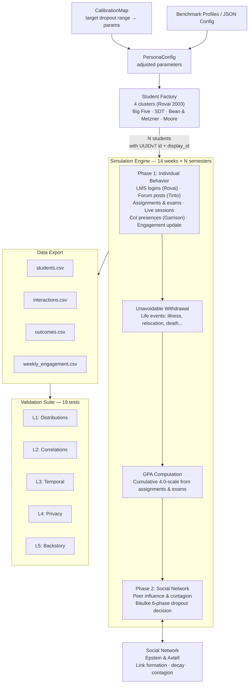

# SynthEd: From synthetic data to simulated learners

[](https://github.com/theaiagent/SynthEd/releases)
[](https://github.com/theaiagent/SynthEd/actions/workflows/ci.yml)
[](#test-suite)
[](https://www.python.org/downloads/)
[](https://github.com/astral-sh/ruff)
[](https://codecov.io/gh/theaiagent/SynthEd)
[](https://doi.org/10.5281/zenodo.19334118)
[](https://opensource.org/licenses/MIT)

**Agent-Based Simulation Environment for Open & Distance Learning Research**

SynthEd is an agent-based simulation environment for open and distance learning (ODL) research that shifts the focus from static data generation to dynamic learner simulation.

By combining persona-driven agent modeling (inspired by [TinyTroupe](https://github.com/microsoft/tinytroupe)) with scalable multi-agent systems (inspired by [MiroFish](https://github.com/666ghj/MiroFish)), SynthEd enables the creation of virtual learners whose behaviors evolve over time based on their motivations, experiences, and contexts.

Rather than producing isolated data points, the system generates behaviorally grounded and temporally coherent learning trajectories, allowing researchers to simulate realistic educational scenarios, test interventions, and develop robust learning analytics models in privacy-constrained settings.

## Why SynthEd?

Educational data mining research faces three persistent challenges:

| Challenge | Traditional Approach | SynthEd Approach |
|-----------|---------------------|-----------------|
| **Privacy regulations** (GDPR/KVKK) restrict access to real student data | Anonymization (risk of re-identification) | Agents are fictional — no real individuals involved |
| **Class imbalance** — real dropout data is sensitive and often skewed | Oversampling (SMOTE) — loses behavioral context | Parameter-level control of dropout rates and population characteristics |
| **Temporal incoherence** — GAN/VAE outputs lack behavioral consistency | Post-hoc smoothing | Persona + memory system produces coherent trajectories |

> **From statistical similarity to behavioral fidelity.** Traditional synthetic data methods optimize for distributional match. SynthEd optimizes for *behavioral coherence* — each data point emerges from a simulated student's evolving motivations, decisions, and life context.

## Use Cases

1. **Dropout Prediction Model Development** — Generate labeled training data with known ground-truth dropout trajectories. Train early warning systems on synthetic data, validate on real institutional data.

2. **Intervention Simulation** — Model "what-if" scenarios: What happens to dropout rates if financial support is increased (reduce `financial_stress_mean`), or if course design improves (increase `dialogue_frequency`)? Compare outcomes across parameter configurations.

3. **Privacy-Safe Benchmarking** — Share synthetic benchmark datasets publicly for reproducible research without privacy concerns. Use benchmark profiles to generate standardized datasets matching different institutional contexts.

## Architecture



## Key Features

- **Persona-Driven Agents**: Each student has Big Five personality traits, motivation type (SDT), self-efficacy, employment status, family responsibilities, and digital literacy — all influencing simulated behavior.
- **Simulation Memory**: Each student's simulation state accumulates events across weeks (assignments, exams, phase transitions), creating realistic engagement trajectories (e.g., a failed midterm reduces subsequent engagement).
- **Configurable Populations**: Calibrate to your institution's demographics using aggregate statistics only (no individual data needed).
- **Multi-Level Validation**: Automatic statistical comparison against reference data using KS-tests, chi-squared tests, correlation checks, and temporal coherence analysis.
- **Optional LLM Enrichment**: Use GPT-4o-mini to generate narrative backstories with automatic retry, validation, and persona-attribute consistency checks (off by default — zero API cost in rule-based mode). Backstories provide researchers with human-readable explanations of *why* each synthetic student behaves the way they do, making datasets more interpretable for presentations, publications, and qualitative analysis. In future versions, backstories will serve as agent context for LLM-driven behavioral simulation (realistic forum posts, assignment text).
- **Privacy by Design**: Synthetic agents are fictional constructs with no mapping to real individuals.
- **Configurable Dropout Targeting**: Specify `target_dropout_range=(0.40, 0.55)` as a single control point — the system automatically estimates simulation parameters via calibration mapping and validates results against the target range.
- **Dual ID System**: Each student has a UUIDv7 `id` (time-sortable, DB/GraphRAG optimized) and a sequential `display_id` (S-0001) for human-readable CSV output and charts. `student_id` (UUIDv7) appears in all four CSV files as the join key. `display_id` (S-0001) appears alongside it for human readability.
- **Unavoidable Withdrawal Events**: Low-probability life events (serious illness, death, forced relocation, career change) that force withdrawal independent of academic engagement. Configurable per-semester rate (default 0.3%). In `outcomes.csv`, voluntary dropout (Bäulke phase 5) has `withdrawal_reason` empty, while unavoidable withdrawal has a specific reason (e.g., 'serious_illness').
- **GPA Computation**: Cumulative GPA (4.0 scale) computed from assignment and exam quality scores, carried across multi-semester runs. Reported in `outcomes.csv` as `final_gpa`. Note: GPA is currently a reporting metric and does not yet influence engagement or dropout decisions during simulation (see Roadmap).
- **Temporal Coherence**: Unlike GAN/VAE-generated datasets, each student's trajectory emerges from a continuous weekly simulation loop where states depend on prior states, producing naturally coherent time series (e.g., failed midterm → declining engagement → dropout).

## Quick Start

### Installation

```bash
git clone https://github.com/theaiagent/SynthEd.git
cd SynthEd
pip install -r requirements.txt
```

### Generate Data (No API Key Needed)

```bash
# Default: 200 students, 14-week semester, rule-based simulation
python run_pipeline.py

# Custom population size
python run_pipeline.py --n 500

# With config file
python run_pipeline.py --config configs/default.json

# Target specific dropout range
python run_pipeline.py --n 300 --target-dropout 0.40 0.55

# Verbose logging (per-student debug output)
python run_pipeline.py --verbose
```

### With LLM Enrichment (Optional)

```bash
export OPENAI_API_KEY="your-key-here"
python run_pipeline.py --n 100 --llm --model gpt-4o-mini
```

### Python API

```python
from synthed.pipeline import SynthEdPipeline

# Single semester (default)
pipeline = SynthEdPipeline(output_dir="./my_output", seed=42)
report = pipeline.run(n_students=300)

print(f"Dropout rate: {report['simulation_summary']['dropout_rate']:.1%}")
print(f"Validation: {report['validation']['summary']['overall_quality']}")
```

```python
# Target a specific dropout range
pipeline = SynthEdPipeline(
    output_dir="./targeted",
    seed=42,
    target_dropout_range=(0.40, 0.55),  # system auto-calibrates
)
report = pipeline.run(n_students=300)
print(f"Dropout: {report['simulation_summary']['dropout_rate']:.1%}")
print(f"Mean GPA: {report['simulation_summary']['mean_final_gpa']:.2f}")
```

### Default Calibration Targets

| Semesters | Default Dropout Rate | Quality |
|-----------|---------------------|---------|
| 1 (14 weeks) | ~46% | A (Excellent) |
| 2 (28 weeks) | ~76% | B (Good) |
| 4 (56 weeks) | ~96% | B (Good) |

These rates use the default `PersonaConfig` (dropout_base_rate=0.80, unavoidable_withdrawal_rate=0.003). Customize with `target_dropout_range` or benchmark profiles.

Targets are approximate means measured at N=500 with 5 random seeds. Actual rates vary by ±5pp depending on seed and population size. Smaller populations (N<200) show higher variance.

### Multi-Semester Simulation

```python
from synthed.pipeline import SynthEdPipeline

# 4 semesters with inter-semester carry-over
pipeline = SynthEdPipeline(output_dir="./multi_sem", seed=42, n_semesters=4)
report = pipeline.run(n_students=300)

# Carry-over between semesters: engagement recovery, social decay,
# dropout phase regression, exhaustion relief, network reset
```

**What carries over between semesters:**

| Carries Over | Resets |
|-------------|--------|
| Academic integration | Weekly engagement history |
| Social integration (decayed 20%) | Memory/event log |
| Engagement (with +0.12 recovery) | Missed assignments streak |
| Dropout phase (regressed by 2) | Dropout status |
| Cost-benefit (with +0.06 recovery) | Network links (decayed) |
| Exhaustion (reduced 70%) | |
| GPA accumulator | |
| CoI presences (partially decayed) | |

### Benchmark Profiles

Generate data matching different institutional contexts:

```python
from synthed.benchmarks.generator import BenchmarkGenerator

gen = BenchmarkGenerator()
report = gen.generate("mega_university", output_dir="./mega_output")
```

| Profile | Scenario | Expected Dropout |
|---------|----------|-----------------|
| `high_dropout_developing` | Developing country ODL, high employment, low digital literacy | 60-90% |
| `moderate_dropout_western` | Western university, mixed employment | 30-60% |
| `low_dropout_corporate` | Corporate training, employer-sponsored | 5-30% |
| `mega_university` | Mega university: very high enrollment, high dropout | 55-85% |

Custom profiles can be added to `synthed/benchmarks/profiles.py`.

```python
# Create pipeline from a benchmark profile
pipeline = SynthEdPipeline.from_profile("high_dropout_developing")
report = pipeline.run(n_students=500)
```

## Output Datasets

| File | Description | Rows | Use Case |
|------|-------------|------|----------|
| `students.csv` | Initial persona attributes (Big Five, motivation, self-efficacy, etc.) with UUIDv7 `student_id` and sequential `display_id` | 1 per student | Feature engineering, clustering |
| `interactions.csv` | Timestamped LMS events (logins, posts, submissions) | ~50-100 per student/week | Sequence modeling, engagement analysis |
| `outcomes.csv` | Dropout status, withdrawal reason, final GPA, final engagement, trend, CoI presences, network degree | 1 per student | Classification, survival analysis |
| `weekly_engagement.csv` | Week-by-week engagement scores | 1 per student | Time series, early warning systems |
| `pipeline_report.json` | Full validation report and pipeline metadata | 1 | Quality assurance |

## Validation Suite

SynthEd validates generated data across five levels:

1. **Marginal Distributions** — KS-test for continuous variables, chi-squared for categorical
2. **Correlation Structure** — Verifies expected relationships (e.g., conscientiousness ↔ dropout)
3. **Temporal Coherence** — Dropout students should show declining engagement trajectories
4. **Privacy Assessment** — k-anonymity check on quasi-identifiers
5. **Backstory Consistency** (optional) — LLM-generated backstories checked for non-empty rate and persona-attribute relevance

Example validation output (19 tests across 11 theoretical anchors):
```
Quality: A (Excellent) — 19/19 tests passed
  ✓ age_distribution (KS-test)
  ✓ gender_distribution (Chi-squared)
  ✓ employment_rate (Z-test)
  ✓ gpa_distribution (KS-test)
  ✓ dropout_rate (Range check or Z-test)
  ✓ tinto_conscientiousness_dropout (expected negative)
  ✓ bandura_self_efficacy_engagement (expected positive)
  ✓ rovai_self_regulation_engagement (expected positive)
  ✓ bean_metzner_financial_stress_dropout (expected positive)
  ✓ tinto_goal_commitment_engagement (expected positive)
  ✓ moore_autonomy_engagement (expected positive)
  ✓ garrison_coi_engagement (expected positive)
  ✓ epstein_network_degree_engagement (expected positive)
  ✓ kember_cost_benefit_engagement (expected positive)
  ✓ sdt_intrinsic_vs_amotivation (intrinsic > amotivation)
  ✓ baulke_phase_distribution (decided phase proportion)
  ✓ engagement_trajectory_divergence (retained > dropout)
  ✓ dropout_negative_trend_rate (decline before dropout)
  ✓ k_anonymity
```

## Theoretical Foundations

SynthEd's persona attributes and simulation mechanics are grounded in eleven established theoretical anchors from ODE dropout research, organized into four factor clusters based on Rovai's (2003) composite persistence model:

### Core Theoretical Anchors

| Anchor | Origin | Role in SynthEd |
|--------|--------|-----------------|
| **Tinto's Student Integration Model** (1975) | Sociology (Durkheim) | Academic & social integration drive `institutional_commitment` → `engagement`. Social integration is deliberately weighted lower in ODE context. |
| **Bean & Metzner's Non-Traditional Student Attrition Model** (1985) | Non-traditional students | Environmental factors (`financial_stress`, `weekly_work_hours`, `has_family_responsibilities`) are the **dominant** dropout predictors, outweighing social integration. |
| **Kember's Longitudinal Process Model** (1989) | Distance education | Centers social/academic integration and cost-benefit evaluation for distance learners. SynthEd operationalizes this as a dynamic `perceived_cost_benefit` that updates weekly based on academic outcomes — a simulation design decision extending Kember's conceptual framework. |
| **Transactional Distance Theory** (Moore, 1993) | Distance education | Course-level `structure_level` and `dialogue_frequency` interact with student `learner_autonomy` to produce transactional distance, which modulates engagement and feeds Kember's cost-benefit calculation. |
| **Self-Determination Theory** (Deci & Ryan, 1985) | Psychology | Intrinsic/extrinsic motivation and amotivation (`motivation_type`) as predictors of persistence and goal commitment. |
| **Community of Inquiry** (Garrison et al., 2000) | Online learning | Three presences (`social_presence`, `cognitive_presence`, `teaching_presence`) emerge from weekly interactions and co-evolve with Tinto's integration constructs. |
| **Rovai's Composite Persistence Model** (2003) | Online/distance learning | `digital_literacy`, `self_regulation`, `time_management`, and `institutional_support_access` as persistence factors specific to ODE. |
| **Bäulke et al. Phase-Oriented Dropout Model** (2022) | Psychology | Dropout modeled as a **phased process**: non-fit perception → thoughts of quitting → deliberation → information search → final decision. Tracked via `dropout_phase`. (Originally developed for general HE; adapted to ODE context in SynthEd.) |
| **Agent-Based Social Simulation** (Epstein & Axtell, 1996) | Computational social science | Methodological framework for bottom-up emergent social behavior. Students form peer networks through forum co-activity; peer influence creates engagement contagion and dropout cascades as emergent phenomena. |
| **Academic Exhaustion** (Gonzalez et al., 2025) | Psychology | Academic exhaustion as a mediator between stressors (workload, financial pressure, time constraints) and dropout risk. Exhaustion accumulates weekly and partially recovers during breaks. |
| **Unavoidable Withdrawal Events** | Life-event modeling | Low-probability stochastic life events (serious illness, death, forced relocation, career change, military deployment) that force involuntary withdrawal independent of engagement or Bäulke phases. 7 event types with configurable per-semester probability. |

### Factor Clusters (Rovai, 2003)

| Cluster | Attributes | Theoretical Source |
|---------|------------|-------------------|
| **Student Characteristics** | `personality` (Big Five), `goal_commitment`, `ode_beliefs`, `motivation_type` | Tinto, Kember, Costa & McCrae (1992), Deci & Ryan (1985) |
| **Student Skills / Needs** | `self_regulation`, `digital_literacy`, `time_management`, `learner_autonomy`, `academic_reading_writing`, `institutional_support_access` | Rovai (2003), Moore (1993), Bäulke et al. |
| **External Factors** | `is_employed`, `weekly_work_hours`, `financial_stress`, `has_family_responsibilities` | Bean & Metzner (1985), Economic Rationality |
| **Internal Factors** | `academic_integration`, `social_integration`, `self_efficacy` | Tinto (1975), Bandura (1997) |
| **Emergent Properties** | `social_presence`, `cognitive_presence`, `teaching_presence` | Garrison et al. (2000) |
| **Network Properties** | `network_degree`, peer influence, dropout contagion | Epstein & Axtell (1996) — emergent from agent co-activity |

### Key Design Decision: ODE ≠ Campus

Following Bean & Metzner's central insight, SynthEd explicitly **weights external/environmental factors higher than social integration** in the dropout risk formula. Social integration is capped at 0.80 and contributes only 4% to the engagement composite — reflecting the empirical reality that distance learners rarely build campus-based social bonds.

### Emergent Properties (ABSS)

Unlike the other theories which map to static persona attributes or individual simulation mechanics, Epstein & Axtell's ABSS framework produces **emergent collective phenomena**:

- **Dropout clustering**: Students connected by forum activity influence each other's engagement; when one begins withdrawing, neighbors are more likely to follow.
- **Social stratification**: Employed students with family responsibilities form fewer connections (Bean & Metzner prediction) and thus receive less peer support, creating a reinforcing disadvantage loop.
- **Teaching presence amplification**: In courses with high instructor dialogue, peer networks amplify the effect as students discuss instructor feedback.

## Project Structure

```
SynthEd/
├── synthed/
│   ├── agents/
│   │   ├── persona.py          # StudentPersona, PersonaConfig, BigFiveTraits
│   │   └── factory.py          # Calibrated population generation
│   ├── simulation/
│   │   ├── engine.py            # Simulation orchestrator (delegates to theories/)
│   │   ├── environment.py       # ODL course structure + positive events
│   │   ├── social_network.py    # Peer network with link decay (Epstein & Axtell)
│   │   ├── semester.py          # Multi-semester runner with carry-over mechanics
│   │   └── theories/            # One module per theoretical framework
│   │       ├── tinto.py         # Academic/social integration (Tinto, 1975)
│   │       ├── bean_metzner.py  # Environmental pressure (Bean & Metzner, 1985)
│   │       ├── kember.py        # Cost-benefit + CoI link (Kember, 1989)
│   │       ├── moore_td.py      # Transactional distance (Moore, 1993)
│   │       ├── sdt_motivation.py # Dynamic motivation (Deci & Ryan, 1985)
│   │       ├── garrison_coi.py  # Community of Inquiry (Garrison et al., 2000)
│   │       ├── rovai.py         # Self-regulation + engagement floor (Rovai, 2003)
│   │       ├── baulke.py        # 6-phase dropout model (Bäulke et al., 2022)
│   │       ├── epstein_axtell.py # Peer influence + contagion
│   │       ├── positive_events.py # Positive environmental events
│   │       ├── academic_exhaustion.py # Academic exhaustion mediator
│   │       └── unavoidable_withdrawal.py  # Life-event withdrawal (illness, relocation, death)
│   ├── data_output/
│   │   └── exporter.py          # CSV dataset generation
│   ├── validation/
│   │   └── validator.py         # 17+ statistical validation tests
│   ├── analysis/
│   │   └── sensitivity.py       # OAT parameter sensitivity analysis
│   ├── benchmarks/
│   │   ├── profiles.py          # Pre-defined ODL institutional profiles
│   │   └── generator.py         # Benchmark dataset generator
│   ├── utils/
│   │   ├── llm.py               # OpenAI wrapper with caching, retries & cost tracking
│   │   ├── log_config.py        # Logging configuration
│   │   └── validation.py        # Input validation utilities
│   ├── calibration.py             # CalibrationMap: target dropout → simulation params
│   └── pipeline.py              # End-to-end orchestrator
├── tests/                        # 226 pytest tests across 19 files
├── configs/
│   └── default.json
├── run_pipeline.py               # CLI entry point
├── requirements.txt
└── README.md
```

## Customization

### Custom Institution Profile

Create a JSON config matching your institution's demographics:

```json
{
  "persona_config": {
    "age_range": [22, 60],
    "employment_rate": 0.80,
    "dropout_base_rate": 0.75,
    "unavoidable_withdrawal_rate": 0.005
  },
  "reference_statistics": {
    "age_mean": 32.0,
    "dropout_rate": 0.50
  }
}
```

### Adding New Interaction Types

Extend `SimulationEngine._simulate_student_week()` to add new behavioral channels (e.g., mobile app usage, tutoring sessions).

## Roadmap

- [x] **Multi-Semester Simulation** — Carry-over mechanics between semesters
- [x] **Sensitivity Analysis** — OAT parameter sweeps
- [x] **Benchmark Datasets** — 4 institutional profiles
- [x] **Academic Exhaustion** — Gonzalez et al. (2025) exhaustion mediator
- [x] **Configurable Dropout Targeting** — CalibrationMap with range-based validation and semester interim reports
- [x] **UUIDv7 Student IDs** — Full UUID, time-sortable, collision-free
- [x] **Dual ID System** — UUIDv7 `id` + sequential `display_id` (S-0001)
- [x] **Unavoidable Withdrawal Events** — 7 life-event types with configurable per-semester probability
- [x] **GPA Computation** — Cumulative GPA from assignment/exam quality, multi-semester carry-over
- [ ] **GPA Feedback Loop** — Feed cumulative GPA into Kember cost-benefit and Bäulke non-fit perception
- [ ] **OULAD-Compatible Export** — 7-table format for drop-in EDM research compatibility
- [ ] **GraphRAG Integration** — Knowledge graph-based curriculum modeling
- [ ] **LLM-Augmented Mode** — Generate realistic forum posts, assignment text
- [ ] **RL Calibration** — Agent Lightning for parameter optimization
- [ ] **Interactive Dashboard** — Vue.js frontend for scenario exploration
- [ ] **Parquet/Arrow Export** — For large-scale data processing
- [ ] **PyPI Package Publication**

## Test Suite

SynthEd includes 226 pytest tests across 19 test files, covering all theory modules, simulation mechanics, LLM enrichment, and the full pipeline.

```bash
python -m pytest tests/ -v --tb=short
```

| Test File | Tests | Coverage |
|-----------|-------|----------|
| `test_persona.py` | 22 | BigFive validation, engagement/dropout bounds, motivation comparison, dict roundtrip, UUIDv7 tests |
| `test_factory.py` | 15 | Population count, seed determinism, attribute ranges, summary keys, dropout scaling, display_id tests |
| `test_engine.py` | 10 | Return types, state completeness, engagement bounds, dropout phases, risk cohort differentiation |
| `test_social_network.py` | 11 | Link creation/strengthening, degree counting, peer influence, link decay, statistics, max degree cap |
| `test_environment.py` | 4 | Default courses, exam week detection, positive events, course lookup |
| `test_validator.py` | 9 | Report structure, z-test symmetry, quality grade thresholds, effective alpha scaling, dropout range tests |
| `test_pipeline_integration.py` | 11 | Full pipeline run, output file creation, validation results, input rejection, calibration, profiles, multi-semester |
| `test_theories.py` | 9 | One test per theory module (Tinto, Bean-Metzner, Moore, Rovai, Garrison, Bäulke, Kember, SDT, Gonzalez) |
| `test_llm_enrichment.py` | 11 | Mock LLM enrichment, backstory export, error handling, cost report, custom pricing |
| `test_llm_client.py` | 17 | LLMClient init, chat, retry, cache, JSON parsing, cost tracking, error handling |
| `test_semester.py` | 12 | Multi-semester carry-over, dropout persistence, engagement recovery, interim reports |
| `test_sensitivity.py` | 2 | OAT parameter sweep, tornado chart data |
| `test_benchmarks.py` | 10 | Profiles registry, profile structure, profile names, generator, list profiles, error handling |
| `test_utils.py` | 14 | Validation helpers (range, int, distribution, boundaries), logging config |
| `test_network_scaling.py` | 4 | Network degree cap, sampling threshold, backward compatibility, large-scale bounds |
| `test_coverage_boost.py` | 37 | Validator edge cases, pipeline branches, exporter skips, environment seasons, Bäulke phases, positive events |
| `test_calibration.py` | 11 | CalibrationMap interpolation, clamping, confidence, range estimation |
| `test_unavoidable_withdrawal.py` | 9 | Withdrawal probability, event types, statistical rate validation |
| `test_gpa.py` | 8 | GPA accumulation, bounds, consistency, CSV export, face validity |

CI runs tests across **Python 3.10, 3.11, and 3.12** on every push and pull request via [GitHub Actions](https://github.com/theaiagent/SynthEd/actions/workflows/ci.yml).

## Legal Disclaimer

> **SynthEd is under active development and is for research and simulation purposes only.**

SynthEd generates **entirely fictional synthetic data**. No real individuals are represented, modeled, or identifiable in any output. The generated personas, interaction logs, and behavioral trajectories are computational artifacts produced by agent-based simulation grounded in published educational theories.

**By using SynthEd, you acknowledge that:**

- You are **fully responsible** for any use you make of the generated outputs.
- Synthetic data should **not** be presented as real student data without clear disclosure.
- The simulation reflects theoretical models, not empirical observations of specific institutions or populations.
- Outputs are intended for **research, development, and educational purposes** — not for making decisions about real individuals.
- SynthEd is **under active development** (pre-release). APIs, default parameters, and output formats may change between versions without prior notice.
- As with any actively developed software, **bugs, inaccuracies, or incomplete features may exist**. Generated data should be independently validated before use in publications or critical research decisions.
- If using the optional LLM enrichment feature, you are responsible for compliance with the LLM provider's terms of service and content policies.

## Responsible Use

SynthEd is designed to **address** ethical challenges in educational data mining, not create them:

- **Privacy by design**: Synthetic agents have no mapping to real individuals, eliminating re-identification risk.
- **Bias awareness**: The simulation parameters (demographics, employment rates, dropout thresholds) reflect configurable assumptions. Users should critically evaluate whether default parameters are appropriate for their research context.
- **Transparency**: All theoretical frameworks, formulas, and calibration decisions are documented in the source code and this README. The simulation is fully auditable.
- **No surveillance**: SynthEd is not designed for, and should not be used for, monitoring or evaluating real students.

## Contributing

Contributions are welcome! Whether you are a researcher, developer, or educator:

- **Report bugs** or suggest features via [GitHub Issues](https://github.com/theaiagent/SynthEd/issues)
- **Submit pull requests** for bug fixes, new theory modules, or benchmark profiles
- **Share feedback** on calibration results or theoretical accuracy
- **Add new theories** by creating a module in `synthed/simulation/theories/` following the existing delegate pattern
- **Add benchmark profiles** for your institution or country in `synthed/benchmarks/profiles.py`

Please ensure all tests pass before submitting:

```bash
ruff check synthed/ tests/ --select E,F,W --ignore E501
python -m pytest tests/ -v --tb=short
```

## License

MIT License. See [LICENSE](LICENSE) for details.

## Contributors

| Contributor | Role |
|-------------|------|
| [Halis Aykut Cosgun](https://github.com/theaiagent) | Project lead, system architecture, development, simulation design, theoretical framework design |
| [Evrim Genc Kumtepe](https://avesis.anadolu.edu.tr/egkumtepe) | Research advisor |
| [Claude](https://claude.ai) (Anthropic) | AI pair programmer — implementation, testing, code review |

## Citation

If you use SynthEd in your research, please cite:

```bibtex
@software{synthed2026,
  author = {Cosgun, Halis Aykut and Kumtepe Genc, Evrim},
  title = {SynthEd: From Synthetic Data to Simulated Learners},
  year = {2026},
  url = {https://github.com/theaiagent/SynthEd},
  doi = {10.5281/zenodo.19334118}
}
```

## Acknowledgments

This project is conceptually inspired by:
- [TinyTroupe](https://github.com/microsoft/tinytroupe) (Microsoft) — Persona-based multi-agent simulation
- [MiroFish](https://github.com/666ghj/MiroFish) — Scalable agent-based prediction engine with GraphRAG
- [Agent Lightning](https://github.com/microsoft/agent-lightning) — RL-based agent optimization framework
