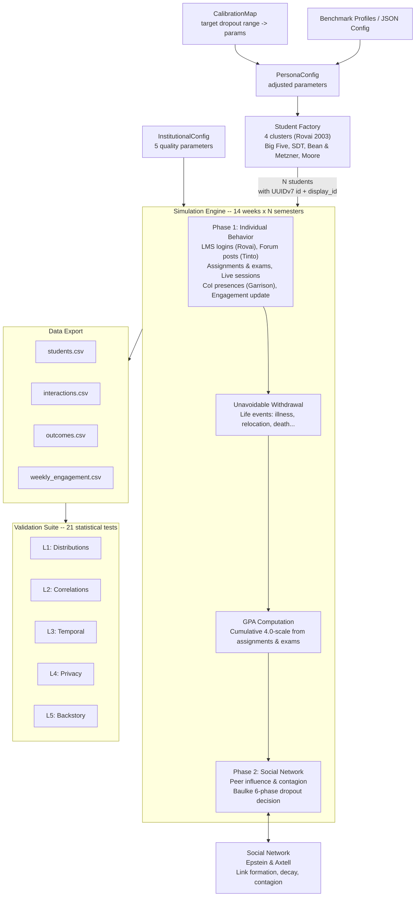

# SynthEd Theoretical Foundations & Architecture

## Table of Contents

- [Architecture](#-architecture)
- [Theoretical Anchors](#-theoretical-anchors)
- [Factor Clusters](#-factor-clusters)
- [Design Decision: ODE is not Campus](#-design-decision-ode-is-not-campus)
- [Emergent Properties](#-emergent-properties)
- [Project Structure](#-project-structure)
- [Validation Suite](#-validation-suite)
- [Test Suite](#-test-suite)

---

## 🏗️ Architecture



---

## 📚 Theoretical Anchors

SynthEd's persona attributes and simulation mechanics are grounded in ten established theoretical frameworks from ODE dropout research:

| # | Anchor | Origin | Role in SynthEd |
|---|--------|--------|-----------------|
| 1 | **Tinto's Student Integration Model** (1975) | Sociology (Durkheim) | Academic & social integration drive engagement. Social integration weighted lower in ODE context. |
| 2 | **Bean & Metzner** (1985) | Non-traditional students | Environmental factors (work, family, finances) are the **dominant** dropout predictors in ODE. Includes stochastic unavoidable withdrawal events (illness, death, relocation) via Lazarus & Folkman's (1984) stress-coping framework. |
| 3 | **Kember's Process Model** (1989) | Distance education | Dynamic `perceived_cost_benefit` updated weekly based on academic outcomes. |
| 4 | **Moore's Transactional Distance** (1993) | Distance education | Course structure and dialogue interact with learner autonomy. |
| 5 | **Self-Determination Theory** (Deci & Ryan, 1985) | Psychology | Intrinsic/extrinsic motivation and amotivation predict persistence. |
| 6 | **Community of Inquiry** (Garrison et al., 2000) | Online learning | Three presences (social, cognitive, teaching) co-evolve with Tinto's integration. |
| 7 | **Rovai's Persistence Model** (2003) | Online/distance learning | Digital literacy, self-regulation, time management as ODE-specific factors. |
| 8 | **Baulke et al. Phase Model** (2022) | Psychology | 6-phase dropout process: non-fit perception -> thoughts -> deliberation -> info search -> decision. Phase thresholds modulated by `support_services_quality` via `scale_by()`. |
| 9 | **Epstein & Axtell ABSS** (1996) | Computational social science | Bottom-up emergent behavior: peer networks, engagement contagion, dropout cascades. |
| 10 | **Academic Exhaustion** (Gonzalez et al., 2025) | Psychology | Exhaustion as mediator between stressors and dropout risk. |

---

## 🧩 Factor Clusters

Organized using Rovai's (2003) composite persistence model:

| Cluster | Attributes | Source |
|---------|------------|--------|
| **Student Characteristics** | personality (Big Five), goal_commitment, ode_beliefs, motivation_type | Tinto, Kember, Costa & McCrae, Deci & Ryan |
| **Student Skills** | self_regulation, digital_literacy, time_management, learner_autonomy | Rovai, Moore, Baulke |
| **External Factors** | employment_intensity, family_responsibility_level, financial_stress | Bean & Metzner, Economic Rationality |
| **Internal Factors** | academic_integration, social_integration, self_efficacy | Tinto, Bandura |
| **Emergent Properties** | social_presence, cognitive_presence, teaching_presence | Garrison et al. |
| **Network Properties** | network_degree, peer influence, dropout contagion | Epstein & Axtell |

---

## ⚖️ Design Decision: ODE is not Campus

Following Bean & Metzner's central insight, SynthEd **weights external/environmental factors higher than social integration** in the dropout risk formula:

- Social integration is capped at 0.80 and contributes only 4% to engagement
- External factors (work, family, finances) contribute 30% to dropout risk
- This reflects empirical ODL research: distance learners rarely build campus-based social bonds

---

## 🌐 Emergent Properties

Unlike static persona-based theories, Epstein & Axtell's ABSS framework produces **emergent collective phenomena**:

- **Dropout clustering:** Connected students influence each other's engagement; one withdrawing increases neighbors' dropout risk.
- **Social stratification:** Employed students with families form fewer connections (Bean & Metzner prediction), creating a reinforcing disadvantage loop.
- **Teaching presence amplification:** High instructor dialogue courses see peer networks amplify the effect as students discuss feedback.

---

## 🏛️ Institutional Quality

Non-academic institutional factors are a major driver of student outcomes. Gonzalez et al. (2025) found that 86.4% of dropout variance is explained by non-academic mechanisms -- including institutional support, technology infrastructure, and course design quality. SynthEd captures this through five institution-level parameters in `InstitutionalConfig`:

| Parameter | Theoretical Grounding |
|-----------|----------------------|
| `instructional_design_quality` | Garrison CoI teaching presence, Moore structure |
| `teaching_presence_baseline` | Garrison CoI, Rovai persistence |
| `support_services_quality` | Bean & Metzner environmental factors |
| `technology_quality` | Moore transactional distance, Rovai digital access |
| `curriculum_flexibility` | Moore dialogue, Kember cost-benefit |

Each parameter ranges 0-1 with 0.5 as neutral. The `scale_by()` method applies multiplicative modulation to theory constants: values above 0.5 improve the constant (e.g., stronger teaching presence, lower transactional distance), while values below 0.5 degrade it. At 0.5 the modulation is identity -- theory constants remain unchanged, preserving backward compatibility with existing calibrations.

---

## 📊 Grading & Outcome Classification

SynthEd supports two grading methods via `GradingConfig`:

- **Absolute grading** (default): Students are classified against fixed thresholds (`pass_threshold`, `distinction_threshold`).
- **Relative grading** (`grading_method="relative"`): Applies t-score standardization across the cohort. Students are classified by their standing relative to peers rather than fixed thresholds. Automatically falls back to absolute grading for cohorts smaller than 2 or with zero or near-zero variance (std < 1e-9).

---

## 📁 Project Structure

```
SynthEd/
├── synthed/
│   ├── agents/
│   │   ├── persona.py          # StudentPersona, PersonaConfig, BigFiveTraits
│   │   ├── factory.py          # Calibrated population generation
│   │   ├── name_pools.py       # Culturally diverse name generation
│   │   └── backstory_templates.py  # 7 templates, 12 life events, 8 contexts
│   ├── simulation/
│   │   ├── engine.py            # Orchestrator (delegates to theories/)
│   │   ├── engine_config.py     # EngineConfig frozen dataclass (70 constants)
│   │   ├── grading.py           # GradingConfig + outcome classification
│   │   ├── state.py             # SimulationState + state management (extracted from engine)
│   │   ├── statistics.py        # summary_statistics (extracted from engine)
│   │   ├── environment.py       # ODL course structure + positive events
│   │   ├── social_network.py    # Peer network with link decay
│   │   ├── semester.py          # Multi-semester with carry-over
│   │   ├── institutional.py     # InstitutionalConfig (5 quality parameters)
│   │   └── theories/            # 10 theory modules + protocol.py (TheoryModule + auto-discovery)
│   ├── data_output/
│   │   ├── exporter.py          # CSV export (4 standard files)
│   │   ├── oulad_exporter.py    # OULAD-compatible 7-table export
│   │   └── oulad_mappings.py    # OULAD schema mappings
│   ├── validation/
│   │   ├── validator.py         # 21 statistical validation tests
│   │   └── types.py             # ReferenceStatistics, ValidationResult
│   ├── analysis/
│   │   ├── sensitivity.py       # OAT parameter sweeps
│   │   ├── sobol_sensitivity.py # Sobol variance decomposition (68 params)
│   │   ├── trait_calibrator.py  # Optuna Bayesian optimization
│   │   ├── oulad_targets.py     # OULAD reference data extraction
│   │   ├── oulad_validator.py   # Held-out module validation
│   │   ├── auto_bounds.py       # Adaptive parameter bounds
│   │   ├── nsga2_calibrator.py  # NSGA-II multi-objective calibration
│   │   ├── pareto_utils.py      # Pareto front utilities
│   │   └── _sim_runner.py       # Shared simulation runner
│   ├── benchmarks/
│   │   ├── profiles.py          # Default benchmark profile
│   │   └── generator.py         # Benchmark dataset generator + report
│   ├── utils/
│   │   ├── llm.py               # OpenAI wrapper with cache, cost, streaming
│   │   ├── llm_memory.py        # Immutable ConversationMemory
│   │   ├── log_config.py        # Logging configuration
│   │   └── validation.py        # Input validation utilities
│   ├── calibration.py           # CalibrationMap: target dropout -> params
│   ├── doc_facts.py             # Documentation consistency checker
│   ├── pipeline_config.py       # PipelineConfig frozen dataclass (16 params)
│   └── pipeline.py              # End-to-end orchestrator
├── tests/                       # 729 pytest tests across 42 files
├── docs/
│   ├── GUIDE.md                 # User guide
│   └── THEORY.md                # This file
├── oulad/                       # Real OULAD reference data — Kuzilek et al. (2017) doi:10.1038/sdata.2017.171
├── run_pipeline.py              # CLI entry point
└── README.md
```

---

## ✅ Validation Suite

21 statistical tests across 5 levels:

| Level | Tests | Method |
|-------|-------|--------|
| **L1: Distributions** | age, gender, employment, GPA, dropout | KS-test, chi-squared, z-test, range check |
| **L2: Correlations** | conscientiousness-dropout, self-efficacy-engagement, self-regulation-engagement, financial-stress-dropout, goal-commitment-engagement, autonomy-engagement, CoI-engagement, network-engagement, cost-benefit-engagement, GPA-dropout, SDT motivation, Baulke phases | Point-biserial r, Pearson r, t-test |
| **L3: Temporal** | engagement divergence, negative trend, early attrition | Mean difference, proportion, timing |
| **L4: Privacy** | k-anonymity | Quasi-identifier grouping |
| **L5: Backstory** | consistency | Content checks (when LLM enabled) |

Quality grades: **A** (90%+), **B** (75%+), **C** (60%+), **D** (40%+), **F** (<40%).

---

## 🧪 Test Suite

729 pytest tests across 42 files:

| Test File | Tests | Coverage |
|-----------|-------|----------|
| `test_persona.py` | 26 | BigFive, engagement/dropout bounds, UUIDv7, disability |
| `test_factory.py` | 26 | Population, seed determinism, attribute ranges, display_id |
| `test_engine.py` | 12 | State, phases, engagement, dropout, std_engagement |
| `test_social_network.py` | 11 | Links, degree, peer influence, decay, statistics |
| `test_theories.py` | 29 | All 10 theory modules + unavoidable withdrawal, GPA feedback, coping, disability |
| `test_pipeline_integration.py` | 11 | Full pipeline, validation, calibration, profiles |
| `test_semester.py` | 19 | Carry-over, dropout persistence, prior_gpa blend |
| `test_llm_enrichment.py` | 12 | Mock LLM, backstory export, error handling |
| `test_llm_client.py` | 27 | Init, chat, retry, cache, cost, base_url, streaming |
| `test_llm_cache.py` | 9 | TTL expiry, LRU eviction, defaults |
| `test_llm_cost_warning.py` | 11 | Cost estimation, threshold, confirm_callback |
| `test_llm_memory.py` | 14 | Immutability, role validation, add/clear |
| `test_backstory_templates.py` | 17 | Templates, life events, regional contexts |
| `test_name_pools.py` | 11 | Name pools, determinism, country context |
| `test_sobol.py` | 26 | Parameter space, sampling, overrides, ranking, validation |
| `test_trait_calibration.py` | 39 | OULAD targets, Optuna, loss functions, held-out validation |
| `test_auto_bounds.py` | 20 | Generation, clipping, filtering, compatibility, edge cases |
| `test_sensitivity.py` | 2 | OAT sweep, tornado chart |
| `test_validator.py` | 9 | Report structure, z-test, grades, dropout range |
| `test_calibration.py` | 11 | Interpolation, clamping, confidence, range estimation |
| `test_oulad_export.py` | 35 | Mappings, 7-table export, schema, determinism |
| `test_benchmarks.py` | 15 | Profiles, generator, report formatting, error handling |
| `test_dual_track_gpa.py` | 12 | Perceived mastery fields, dual-track recording, theory module switching |
| `test_opportunity_cost.py` | 5 | Opportunity cost pressure, time discount, backward compat |
| `test_environmental_shocks.py` | 26 | Shock generation, engine integration, Baulke phase advance |
| `test_environment.py` | 4 | Courses, exam weeks, positive events |
| `test_utils.py` | 14 | Validation helpers, logging config |
| `test_network_scaling.py` | 4 | Degree cap, sampling threshold |
| `test_coverage_boost.py` | 37 | Edge cases, pipeline branches, Baulke phases |
| `test_coverage_gaps.py` | 8 | Additional coverage edge cases |
| `test_institutional_config.py` | 15 | InstitutionalConfig validation, scale_by, defaults |
| `test_institutional_integration.py` | 5 | Pipeline integration with InstitutionalConfig |
| `test_nsga2_calibrator.py` | 12 | NSGA-II calibration, Pareto front, knee-point |
| `test_pareto_utils.py` | 10 | Pareto dominance, front extraction, utilities |
| `test_unavoidable_withdrawal.py` | 9 | Withdrawal probability, event types |
| `test_gpa.py` | 9 | GPA accumulation, bounds, feedback loop |
| `test_grading.py` | 47 | GradingConfig, outcome classification, semester grades |
| `test_engine_grading.py` | 6 | Engine grading integration, floor-adjusted outcomes |
| `test_engine_config.py` | 19 | EngineConfig frozen dataclass, validation, replace |
| `test_baulke_institutional.py` | 11 | Baulke institutional modulation, threshold scaling |
| `test_pipeline_config.py` | 19 | PipelineConfig frozen dataclass, serialization |
| `test_theory_protocol.py` | 32 | TheoryModule protocol, phase dispatch, auto-discovery, engagement deltas |

CI runs tests across **Python 3.10, 3.11, and 3.12** via [GitHub Actions](https://github.com/theaiagent/SynthEd/actions/workflows/ci.yml).
