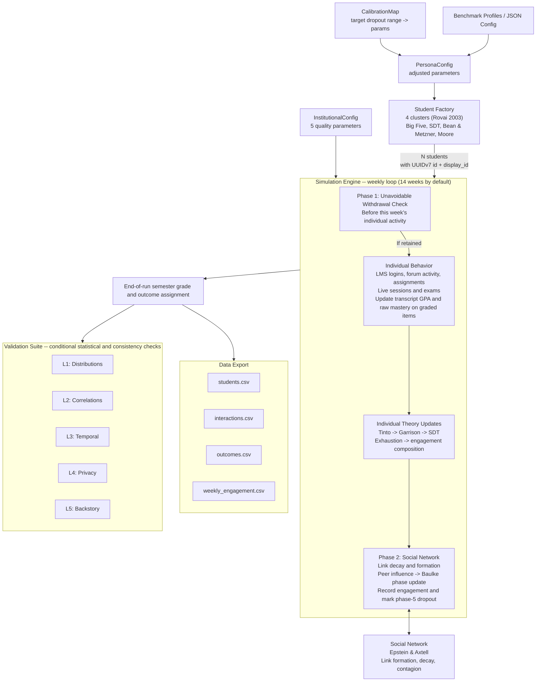

# SynthEd Theoretical Foundations & Architecture

## Table of Contents

- [Architecture](#-architecture)
- [Theoretical Anchors](#-theoretical-anchors)
- [Factor Clusters](#-factor-clusters)
- [Design Decision: ODE is not Campus](#-design-decision-ode-is-not-campus)
- [Emergent Properties](#-emergent-properties)
- [Institutional Quality](#-institutional-quality)
- [Grading and Outcome Classification](#-grading-and-outcome-classification)
- [Project Structure](#-project-structure)
- [Validation Suite](#-validation-suite)
- [Test Suite](#-test-suite)

---

## 🏗️ Architecture


```mermaid
flowchart TD
    CM["CalibrationMap\ntarget dropout range -> params"]
    BP["Benchmark Profiles / JSON Config"]
    IC["InstitutionalConfig\n5 quality parameters"]
    PC["PersonaConfig\nadjusted parameters"]

    CM --> PC
    BP --> PC

    SF["Student Factory\n4 clusters (Rovai 2003)\nBig Five, SDT, Bean & Metzner, Moore"]
    PC --> SF
    IC --> engine

    SF -->|"N students\nwith UUIDv7 id + display_id"| engine

    subgraph engine ["Simulation Engine -- weekly loop (14 weeks by default)"]
        direction TB
        UW["Phase 1: Unavoidable Withdrawal Check\nBefore this week's individual activity"]
        P1["Individual Behavior\nLMS logins, forum activity, assignments\nLive sessions and exams\nUpdate transcript GPA and raw mastery on graded items"]
        TH["Individual Theory Updates\nTinto -> Garrison -> SDT\nExhaustion -> engagement composition"]
        P2["Phase 2: Social Network\nLink decay and formation\nPeer influence -> Baulke phase update\nRecord engagement and mark phase-5 dropout"]
        UW -->|"If retained"| P1 --> TH --> P2
    end

    SN["Social Network\nEpstein & Axtell\nLink formation, decay, contagion"]
    P2 <--> SN

    engine --> GR["End-of-run semester grade and outcome assignment"]
    GR --> EX

    subgraph EX ["Data Export"]
        direction LR
        E1["students.csv"]
        E2["interactions.csv"]
        E3["outcomes.csv"]
        E4["weekly_engagement.csv"]
    end

    GR --> VAL

    subgraph VAL ["Validation Suite -- conditional statistical and consistency checks"]
        direction LR
        V1["L1: Distributions"]
        V2["L2: Correlations"]
        V3["L3: Temporal"]
        V4["L4: Privacy"]
        V5["L5: Backstory"]
    end
```

`SimulationEngine.run()` returns `(records, states, network)`: a list of `InteractionRecord`, a dictionary of `SimulationState` keyed by student ID, and a `SocialNetwork`. `MultiSemesterRunner` repeats the engine with carry-over between semesters. Unavoidable withdrawal skips that student's remaining weekly activity; GPA and mastery are updated during assignment/exam processing, before the individual theory updates. Weekly engagement is recorded after peer influence and the Baulke update.

In a normal run, the pipeline exports the four standard CSV files, validates dictionaries prepared from the in-memory personas and states, and returns a report dictionary (also saved as `pipeline_report.json` when an output directory is configured). Validation does not read the exported CSVs. `students.csv` contains initial persona values; evolved values are in `outcomes.csv`.

`CalibrationMap` estimates `dropout_base_rate` from the requested cumulative dropout range and simulation horizon. Its built-in curves describe the default model; changing the institution, grading, population configuration, or environment can invalidate that transfer. The pipeline reports whether observed dropout falls within the requested range. Targeting is an estimate, and checking that same target range is not independent empirical validation of the model.

---

## 📚 Theoretical Anchors

SynthEd's persona attributes and simulation mechanics draw on ten theoretical anchors from student-persistence, psychology, online/distance learning, and agent-based simulation research. The equations and coefficients are SynthEd's operationalizations of these anchors, rather than a direct reproduction of each publication's model:

| # | Anchor | Origin | Role in SynthEd |
|---|--------|--------|-----------------|
| 1 | **Tinto's Student Integration Model** (1975) | Sociology (Durkheim) | Academic & social integration drive engagement. Social integration weighted lower in ODE context. |
| 2 | **Bean & Metzner** (1985) | Non-traditional students | Work, family and financial pressures reduce engagement; coping and temporary environmental shocks model stress responses. A separate unavoidable-withdrawal process can end participation immediately, independently of Baulke phase progression. |
| 3 | **Kember's Process Model** (1989) | Distance education | Dynamic `perceived_cost_benefit` recalculated on graded items, exam weeks or persistent missed streaks. The missed-event penalty additionally requires a new miss that week; existing cost-benefit effects persist. |
| 4 | **Moore's Transactional Distance** (1993) | Distance education | Course structure and dialogue interact with learner autonomy. |
| 5 | **Self-Determination Theory** (Deci & Ryan, 1985) | Psychology | Intrinsic/extrinsic motivation and amotivation predict persistence. |
| 6 | **Community of Inquiry** (Garrison et al., 2000) | Online learning | Three presences (social, cognitive, teaching) co-evolve with Tinto's integration. |
| 7 | **Rovai's Persistence Model** (2003) | Online/distance learning | Digital literacy, self-regulation, time management as ODE-specific factors. |
| 8 | **Baulke et al. Phase Model** (2022) | Psychology | SynthEd implements states 0-5: baseline -> non-fit perception -> thoughts -> deliberation -> info search -> decision, with recovery transitions before the final decision. Phase thresholds modulated by `support_services_quality` via `scale_by()`. |
| 9 | **Epstein & Axtell ABSS** (1996) | Computational social science | Bottom-up emergent behavior: peer networks, engagement contagion, dropout cascades. |
| 10 | **Academic Exhaustion** (Gonzalez et al., 2025) | Psychology | Inspired by the study's mediation model of dropout intention. SynthEd accumulates exhaustion from assignments due in the student's active courses and other stressors, models recovery, and links exhaustion to engagement and Baulke transitions. |

---

## 🧩 Factor Clusters

Organized using Rovai's (2003) composite persistence model:

| Cluster | Attributes | Source |
|---------|------------|--------|
| **Student Characteristics** | personality (Big Five), goal_commitment, ode_beliefs, motivation_type | Tinto, Kember, Costa & McCrae, Deci & Ryan |
| **Student Skills** | self_regulation, digital_literacy, time_management, learner_autonomy | Rovai, Moore, Baulke |
| **External Factors** | employment_intensity, family_responsibility_level, financial_stress | Bean & Metzner, Economic Rationality |
| **Internal Factors** | academic_integration, social_integration, self_efficacy | Tinto, Bandura |
| **Emergent Properties** | `social_presence`, `cognitive_presence`, `teaching_presence` (emergent; stored on `SimulationState.coi_state`, not on `StudentPersona`) | Garrison et al. |
| **Network Properties** | network_degree, peer influence, dropout contagion | Epstein & Axtell |

---

## ⚖️ Design Decision: ODE is not Campus

Following Bean & Metzner's emphasis on non-traditional students, SynthEd **weights external/environmental factors higher than social integration** in the initial `base_dropout_risk` formula:

- Social integration is capped at 0.80 in population generation and weekly integration updates. Its coefficient is 0.04 in initial `base_engagement_probability`; the default weekly Tinto engagement coefficient is 0.02.
- The external-risk block has nominal coefficients totaling 0.30 for work, family, finances **and internet reliability**. Input transformations, scaling and clipping mean this is not a fixed 30% share of an individual's risk or of observed dropouts.
- These are modeling choices for the ODL context. Actual withdrawal emerges from weekly dynamics, the Baulke decision process and the separate unavoidable-withdrawal process.

---

## 🌐 Emergent Properties

SynthEd implements peer mechanisms inspired by Epstein & Axtell's ABSS framework that can produce **emergent collective phenomena**:

- **Dropout clustering:** Connected students influence each other's engagement; neighbors in dropout phases 4 or 5 add an engagement penalty. Unavoidable withdrawal alone does not advance the dropout phase.
- **Unequal connectivity:** Links form through shared forum posting and live-session attendance. Work and family pressures can reduce engagement and thus opportunities to connect; fewer connections are a possible outcome, not a fixed rule.
- **Social presence reinforcement:** Network degree boosts social integration and CoI social presence. Teaching presence is updated from course dialogue, instructor responsiveness and support access; the network does not directly amplify teaching presence.

---

## 🏛️ Institutional Quality

Institutional conditions are represented as configurable influences on student dynamics. [Gonzalez et al. (2025)](https://doi.org/10.1371/journal.pone.0327643) studied 1,402 Portuguese university students in a cross-sectional survey: their model explained **51% of variance in dropout intention**, with academic exhaustion as the strongest predictor. These findings concern dropout intention in that sample; they do not quantify a share of actual dropouts caused by institutional factors. SynthEd's five `InstitutionalConfig` parameters are modeling choices, not coefficients estimated in that study:

| Parameter | Implemented Mechanism |
|-----------|----------------------|
| `instructional_design_quality` | Scales assignment/exam quality weights and Kember's response to graded quality |
| `teaching_presence_baseline` | Directly initializes CoI teaching presence |
| `support_services_quality` | Scales exhaustion recovery and Baulke transition/recovery thresholds |
| `technology_quality` | Scales literacy-floor terms in LMS-login and forum-reading rates |
| `curriculum_flexibility` | Inversely scales exhaustion from assignments due in active courses |

Each parameter ranges 0-1 with 0.5 as neutral. The `scale_by()` function multiplies a constant by `low + (high - low) * inst_param` (default bounds 0.7 and 1.3). Call sites can invert the parameter or use different bounds; the direction of the effect depends on the mechanism. Teaching presence initialization uses the baseline directly. Neutral settings preserve the unmodulated constants, but do not guarantee that historical calibration results survive other model changes.

---

## 📊 Grading and Outcome Classification

SynthEd supports two grading methods via `GradingConfig`:

- **Absolute grading** (default): Eligible students are classified against fixed thresholds (`pass_threshold`, `distinction_threshold`) after applying `grade_floor + (1 - grade_floor) * raw_semester_grade`.
- **Relative grading** (`grading_method="relative"`): Applies t-score standardization to raw semester grades of eligible students, divides the resulting scores by 100, and classifies them using the same thresholds. Automatically falls back to absolute grading with fewer than 2 eligible students or zero or near-zero raw-score variance (std < 1e-9). Optional dual-hurdle checks still use floor-adjusted component scores.

The engine keeps two performance tracks: `cumulative_gpa` is the mean floor-adjusted assignment/exam quality on a 4.0 scale, while `perceived_mastery` is the raw mean quality on [0, 1] (0.5 before any graded items). Kember, SDT competence and Baulke's mastery conditions use the raw track. `SimulationState.semester_grade` is a separate raw [0, 1] value or `None`, calculated from the configured assessment mode and components. Outcomes are `Withdrawn`, `Fail`, `Pass` or `Distinction`; withdrawal takes precedence, and missing required grading inputs or unmet eligibility requirements produce `Fail`.

The standard `outcomes.csv` exports transcript GPA as `final_gpa` (blank when no items were graded). It does not currently export `semester_grade`, `perceived_mastery` or the categorical `outcome`; the pipeline report includes aggregate outcome counts, and the optional OULAD export includes `final_result`.

---

## 📁 Project Structure

```
SynthEd/
├── synthed/
│   ├── agents/
│   │   ├── persona.py          # StudentPersona, PersonaConfig, BigFiveTraits
│   │   ├── factory.py          # Calibrated population generation
│   │   ├── name_pools.py       # Culturally diverse name generation
│   │   └── backstory_templates.py  # 7 templates, 12 life events, 8 contexts
│   ├── simulation/
│   │   ├── engine.py            # Orchestrator (delegates to theories/)
│   │   ├── engine_config.py     # EngineConfig frozen dataclass (70 constants)
│   │   ├── grading.py           # GradingConfig + outcome classification
│   │   ├── state.py             # SimulationState + state management (extracted from engine)
│   │   ├── statistics.py        # summary_statistics (extracted from engine)
│   │   ├── environment.py       # ODL course structure + positive events
│   │   ├── social_network.py    # Peer network with link decay
│   │   ├── semester.py          # Multi-semester with carry-over
│   │   ├── institutional.py     # InstitutionalConfig (5 quality parameters)
│   │   └── theories/            # 10 theory modules + positive_events, unavoidable_withdrawal, protocol
│   ├── data_output/
│   │   ├── exporter.py          # CSV export (4 standard files)
│   │   ├── oulad_exporter.py    # OULAD-compatible 7-table export
│   │   └── oulad_mappings.py    # OULAD schema mappings
│   ├── validation/
│   │   ├── validator.py         # Conditional distribution, correlation, temporal, privacy and backstory checks
│   │   └── types.py             # ReferenceStatistics, ValidationResult
│   ├── analysis/
│   │   ├── sensitivity.py       # OAT parameter sweeps
│   │   ├── sobol_sensitivity.py # Sobol variance decomposition (68 params)
│   │   ├── trait_calibrator.py  # Optuna Bayesian optimization
│   │   ├── oulad_targets.py     # OULAD reference data extraction
│   │   ├── oulad_validator.py   # Held-out module validation
│   │   ├── auto_bounds.py       # Adaptive parameter bounds
│   │   ├── nsga2_calibrator.py  # NSGA-II multi-objective calibration
│   │   ├── pareto_utils.py      # Pareto front utilities
│   │   └── _sim_runner.py       # Shared simulation runner
│   ├── benchmarks/
│   │   ├── profiles.py          # Default benchmark profile
│   │   └── generator.py         # Benchmark dataset generator + report
│   ├── dashboard/
│   │   ├── __main__.py          # `python -m synthed.dashboard` entry point
│   │   ├── app.py               # Shiny for Python app (reactive UI, simulation runner)
│   │   ├── theme.py             # Dark/light theme color palette (WCAG AA contrast)
│   │   ├── charts.py            # Plotly chart builders (on-screen)
│   │   ├── config_bridge.py     # Frozen config dataclasses <-> reactive UI values
│   │   └── components/          # param_panel, distribution_editor, warnings, results_panel
│   ├── report/
│   │   ├── generator.py         # HTML/PDF report generator (optional deps: jinja2, playwright)
│   │   ├── charts.py            # Print-friendly chart builders (white bg, dark text)
│   │   ├── translations.py      # i18n strings (EN/TR)
│   │   └── templates/report.html
│   ├── utils/
│   │   ├── llm.py               # OpenAI wrapper with cache, cost, streaming
│   │   ├── llm_memory.py        # Immutable ConversationMemory
│   │   ├── log_config.py        # Logging configuration
│   │   └── validation.py        # Input validation utilities
│   ├── calibration.py           # CalibrationMap: target dropout -> params
│   ├── doc_facts.py             # Documentation consistency checker
│   ├── pipeline_config.py       # PipelineConfig frozen dataclass (16 params)
│   └── pipeline.py              # End-to-end orchestrator
├── tests/                       # 1072 pytest tests across 54 files
├── docs/
│   ├── GUIDE.md                 # User guide
│   └── THEORY.md                # This file
├── oulad/                       # Real OULAD reference data — Kuzilek et al. (2017) doi:10.1038/sdata.2017.171
├── run_pipeline.py              # CLI entry point
└── README.md
```

---

## ✅ Validation Suite

`SyntheticDataValidator` emits 24 checks with default reference settings when temporal assessment is requested, including 2 backstory checks. Without non-empty text, both backstory checks are `not_assessed`; text absence does not establish whether enrichment was attempted. Configuring pass/distinction reference rates adds up to 2 checks (26 in total). Missing, insufficient, constant or non-finite correlation inputs produce visible `not_assessed` rows with a reason and null measurements. Omitting temporal input (`weekly_engagement=None`) omits its 3 checks; requesting it with an empty mapping emits them as unassessed. Not every check is a statistical hypothesis test. Checks span 5 levels:

| Level | Tests | Method |
|-------|-------|--------|
| **L1: Distributions** | age, gender, employment, prior GPA, dropout | KS-test, chi-squared, z-test, range check |
| **L2: Correlations and outcomes** | conscientiousness-dropout, self-efficacy-engagement, self-regulation-engagement, financial-stress-dropout, goal-commitment-engagement, autonomy-engagement, CoI-engagement, network-engagement, cost-benefit-engagement, final GPA-dropout, engagement-final GPA, SDT motivation, Baulke phases; optional pass/distinction rates | Point-biserial r, Pearson r, t-test, phase-proportion and outcome-rate checks |
| **L3: Temporal** | engagement divergence, negative trend, early attrition | Mean difference, proportion, timing |
| **L4: Privacy** | k-anonymity approximation | Grouping by age, gender and socioeconomic level; an informational check, not a general privacy guarantee |
| **L5: Backstory** | non-empty rate, attribute relevance | Whole-cohort text coverage and keyword relevance among non-empty texts; N/A when no text is available |

**Validation inputs:** `_prepare_validation_data()` forwards persona `backstory` and the engine's authoritative `outcome`. Outcome-rate checks require every supplied row to contain exactly `Pass`, `Distinction`, `Fail` or `Withdrawn`. An empty list or any missing/invalid label makes each configured rate `not_assessed`, with total/valid/invalid counts and null measurements. For complete labels, both rates use the entire outcome list as their denominator; Pass excludes Distinction, while Fail and Withdrawn remain in the denominator. Each check passes only when its absolute reference difference is strictly below 15 percentage points; a `None` reference omits that check.

Backstory coverage uses all student rows, including missing, whitespace-only and non-text values. Keyword relevance uses only non-empty strings. Existing passing thresholds remain 50% coverage and 30% relevance; the displayed reference values are 80% and 50%, respectively. These checks describe text coverage and keyword matches, not narrative fidelity or enrichment success. Adding visible N/A rows changes total counts without increasing assessed counts; passing text checks can change the assessed grade.

Quality grades: **A** (90%+), **B** (75%+), **C** (60%+), **D** (40%+), **F** (<40%) of assessed checks (`passed + failed`). `not_assessed` is separate from failure and excluded from the pass-rate denominator. With no assessed checks, quality is **N/A (Not assessed)** and `pass_rate` is 0.0. Reports expose `total_tests`, `assessed_tests`, `passed`, `failed`, `not_assessed` and `assessment_complete`; the latter is false whenever an emitted check is unassessed. Tables and radar charts disclose coverage, and radar scores exclude unassessed checks. Historical rows without a status derive it from their boolean `passed`; summary-only historical reports retain their original grade and treat their total as assessed. New pipeline JSON forbids NaN/Infinity.

Correlation checks pass on the expected sign, and the SDT comparison passes on the expected ordering of group means; reported p-values and reference magnitudes are not their pass criteria. A high grade therefore summarizes these implemented checks, not comprehensive empirical or literature validation. Grades from older reports that counted undefined checks as failures are not directly comparable to the new assessed-only grades; compare coverage as well.

---

## 🧪 Test Suite

1072 pytest tests across 54 files:

<!-- BEGIN:test_inventory -->
| Test File | Tests | Coverage |
|-----------|-------|----------|
| `test_auto_bounds.py` | 20 | auto_bounds parameter generation |
| `test_backstory_templates.py` | 17 | backstory template selection and prompt building |
| `test_baulke_institutional.py` | 11 | Baulke institutional modulation via InstitutionalConfig. |
| `test_benchmarks.py` | 15 | benchmark profiles and generator |
| `test_calibration.py` | 23 | CalibrationMap interpolation and estimation |
| `test_coverage_boost.py` | 37 | boost coverage from 93% to 95%+. |
| `test_coverage_gaps.py` | 8 | close remaining coverage gaps |
| `test_dashboard.py` | 42 | SynthEd Dashboard config bridge, distribution normalization, and charts |
| `test_dashboard_a11y.py` | 5 | dashboard (audit P1-6/P1-7/P1-10/P3-2). |
| `test_dashboard_calibrate.py` | 40 | the Calibrate tab UI components (PR B scorecard) |
| `test_dashboard_nav.py` | 3 | the two-tab mode-split skeleton (PR A). |
| `test_dashboard_theme.py` | 7 | dashboard theme & layout fixes (v1.7.0). |
| `test_dual_track_gpa.py` | 12 | dual-track GPA: transcript GPA vs perceived mastery |
| `test_engine.py` | 17 | the SimulationEngine |
| `test_engine_config.py` | 19 | EngineConfig frozen dataclass |
| `test_engine_grading.py` | 14 | GradingConfig |
| `test_environment.py` | 7 | ODLEnvironment |
| `test_environmental_shocks.py` | 26 | Environmental Shocks (Bean & Metzner Phase 3 — stochastic life events) |
| `test_factory.py` | 26 | StudentFactory population generation |
| `test_gpa.py` | 9 | GPA/academic success computation |
| `test_grading.py` | 49 | GradingConfig and grading utilities |
| `test_horizon_diagnostics.py` | 15 | Guard the diagnostic observer against changing the stochastic model |
| `test_institutional_config.py` | 15 | InstitutionalConfig validation, scale_by, defaults |
| `test_institutional_integration.py` | 5 | InstitutionalConfig wired into SimulationEngine |
| `test_kember_events.py` | 18 | Kember current-week missed events, persistent feedback and engine integration |
| `test_llm_cache.py` | 9 | LLM cache TTL expiry and LRU eviction |
| `test_llm_client.py` | 28 | LLMClient with mocked OpenAI API |
| `test_llm_cost_warning.py` | 11 | LLM cost estimation and warning system |
| `test_llm_enrichment.py` | 12 | LLM enrichment feature: backstory generation, export, and error handling |
| `test_llm_memory.py` | 14 | ConversationMemory and LLM streaming |
| `test_name_pools.py` | 11 | name_pools module |
| `test_network_scaling.py` | 7 | network scaling: sampling, degree caps, backward compatibility |
| `test_nsga2_calibrator.py` | 25 | NSGA-II calibration, Pareto front, knee-point, parallel branch, profile-object signatures |
| `test_opportunity_cost.py` | 5 | Kember opportunity cost mechanism |
| `test_oulad_export.py` | 35 | OULAD-compatible export |
| `test_pareto_utils.py` | 19 | Pareto dominance, front extraction, utilities |
| `test_persona.py` | 27 | StudentPersona and BigFiveTraits |
| `test_pipeline_config.py` | 40 | PipelineConfig frozen dataclass |
| `test_pipeline_integration.py` | 46 | SynthEdPipeline |
| `test_report.py` | 11 | SynthEd report generation module |
| `test_semester.py` | 26 | MultiSemesterRunner carry-over and multi-semester logic |
| `test_sensitivity.py` | 2 | sensitivity analysis module |
| `test_sobol.py` | 48 | Sobol sensitivity analysis |
| `test_social_network.py` | 11 | SocialNetwork |
| `test_theories.py` | 35 | individual theory modules |
| `test_theory_protocol.py` | 32 | TheoryModule Protocol, TheoryContext, and auto-discovery |
| `test_trait_calibration.py` | 39 | OULAD target extraction and trait-based calibration |
| `test_unavoidable_withdrawal.py` | 9 | the UnavoidableWithdrawal theory module |
| `test_utils.py` | 14 | shared utility modules: validation and log_config |
| `test_validation_assessment.py` | 11 | Regression checks for undefined validation measurements and coverage |
| `test_validation_consumers.py` | 15 | Regression tests for assessment coverage in rendered reports and exports |
| `test_validation_report_contract.py` | 7 | Coverage and legacy compatibility for the shared validation report contract |
| `test_validation_types.py` | 28 | synthed.validation.types dataclasses |
| `test_validator.py` | 35 | SyntheticDataValidator |
<!-- END:test_inventory -->

CI runs tests across **Python 3.10, 3.11, and 3.12** via [GitHub Actions](https://github.com/theaiagent/SynthEd/actions/workflows/ci.yml).
