# Calibration & Sensitivity Analysis

> **Looking for how to _run_ calibration?** See [GUIDE.md](../GUIDE.md) for CLI usage
> (`run_calibration.py --quick`, `--workers`, `--profile`). This page explains the
> internal mechanics, algorithms, and code architecture that power calibration.

SynthEd ships a three-stage calibration pipeline that tunes simulation constants to
match real-world dropout and GPA distributions. The stages run in sequence:

1. **Sobol sensitivity analysis** -- identifies which parameters matter most
2. **NSGA-II multi-objective optimization** -- searches the reduced parameter space
3. **OULAD validation** -- checks calibrated output against held-out real data

All code lives in `synthed/analysis/`.

---

## Architecture Overview

```mermaid
flowchart LR
    subgraph "Stage 1: Sensitivity"
        A[SOBOL_PARAMETER_SPACE<br/>69 params, 13 prefixes] --> B[SobolAnalyzer]
        B -->|SALib Saltelli sampling| C["N*(D+2) simulations"]
        C --> D[SobolResult<br/>S1, ST per metric]
        D --> E[SobolRanking<br/>sorted by ST]
    end

    subgraph "Stage 2: Optimization"
        E -->|top-N, exclude config/inst| F[select_nsga2_parameters]
        F --> G[NSGAIICalibrator]
        G -->|Optuna NSGAIISampler| H[Pareto front]
        H --> I[find_knee_point]
        I --> J[ParetoResult]
    end

    subgraph "Stage 3: Validation"
        J --> K[validate_against_oulad]
        K -->|held-out modules CCC, GGG| L[ValidationReport<br/>grade A/B/C/D]
    end

    style A fill:#f9f,stroke:#333
    style J fill:#9f9,stroke:#333
    style L fill:#ff9,stroke:#333
```



---

## CalibrationMap

**File:** `synthed/calibration.py`

`CalibrationMap` provides a quick lookup: given a target dropout rate, what
`dropout_base_rate` should you set in `PersonaConfig`? It uses **piecewise linear
interpolation** over empirically measured data points.

### How CALIBRATION_DATA was measured

The `CALIBRATION_DATA` tuple contains `CalibrationPoint` entries measured with:

| Setting | Value |
|---------|-------|
| Population | N=500 students |
| Seeds | 5 seeds averaged per point |
| Persona | Default `PersonaConfig()` (no custom traits) |
| Date | 2026-04-03 (post `GradingConfig` addition) |

Each point records: `(n_semesters, dropout_base_rate, observed_dropout_rate, n_students, seed_count)`.

### Interpolation logic

```
CalibrationMap.estimate(target_dropout, n_semesters=1)
```

1. Filter `CALIBRATION_DATA` to matching `n_semesters`
2. If fewer than 2 points, fall back to 1-semester data (confidence = `"low"`)
3. Sort by `observed_dropout_rate`
4. `np.interp(target_dropout, observed_rates, base_rates)` -- piecewise linear
5. Clamp result to `[_MIN_BASE_RATE (0.10), _MAX_BASE_RATE (0.95)]`
6. Return `CalibrationEstimate` with confidence `"high"` (interpolated) or `"low"` (clamped/fallback)

**Example:** Target 45% dropout for 1 semester:

- Two nearest points: `(0.50, 0.442)` and `(0.60, 0.468)`
- Interpolation yields `dropout_base_rate ~ 0.515`
- Confidence: `"high"` (within calibrated range)

The `estimate_from_range()` variant takes a `(lower, upper)` tuple, interpolates at
the midpoint, and sets `validation_tolerance` to half the range width.

### Staleness warning

> `CALIBRATION_DATA` was measured with **default persona traits only**. If you change
> theory module constants, engine weights, or any RNG-consuming code path (even
> non-dropout features shift the RNG sequence), the mapping becomes stale.
> Re-measure by running a sweep of `dropout_base_rate` values across seeds.

---

## Stage 1: Sobol Sensitivity Analysis

**File:** `synthed/analysis/sobol_sensitivity.py`

### The parameter space

`SOBOL_PARAMETER_SPACE` defines **69 parameters** across **13 prefixes**:

| Prefix | Engine attribute | Count | Description |
|--------|-----------------|-------|-------------|
| `config` | `PersonaConfig` field | 8 | Population characteristics |
| `engine` | `EngineConfig` field | 15 | Engagement update weights, quality weights |
| `bean` | `engine.bean_metzner` | 7 | Environmental pressure |
| `kember` | `engine.kember` | 6 | Cost-benefit |
| `baulke` | `engine.baulke` | 6 | Dropout phase thresholds |
| `inst` | `InstitutionalConfig` field | 5 | Institutional quality |
| `sdt` | `engine.sdt` | 4 | Motivation dynamics |
| `gonzalez` | `engine.gonzalez` | 4 | Academic exhaustion |
| `grading` | `GradingConfig` field | 4 | Grade floor, thresholds, late penalty |
| `tinto` | `engine.tinto` | 3 | Integration |
| `rovai` | `engine.rovai` | 3 | Persistence |
| `garrison` | `engine.garrison` | 2 | Community of Inquiry |
| `moore` | `engine.moore` | 2 | Transactional distance |

> **Phantom prefix:** `epstein` appears in `MODULE_ALIASES` (mapping to
> `engine.epstein_axtell`) but **no `SobolParameter` uses it**. The Epstein & Axtell
> network module's constants are excluded from sensitivity analysis because network
> formation is structural, not tuneable in the same sense.

### SobolParameter dataclass

Each parameter is a frozen dataclass:

```python
SobolParameter(
    name="baulke._NONFIT_ENG_THRESHOLD",  # prefix.attribute
    lower=0.30,                            # lower bound
    upper=0.55,                            # upper bound
    description="Non-fit perception trigger",
    log_scale=False,                       # Phase 2: Optuna log-uniform
    step=None,                             # Phase 2: discretization
)
```

The `name` follows a strict `prefix.attribute` convention. The prefix determines
how `_sim_runner` routes the override (see below).

### How the analysis runs

```python
analyzer = SobolAnalyzer(n_students=200, seed=42)
results = analyzer.run(n_samples=128)
rankings = analyzer.rank(results[0])  # rank by dropout_rate ST
```

**Sampling:** Saltelli method from SALib. With `calc_second_order=False`, total
simulations = `n_samples * (D + 2)`. Default: `128 * (69 + 2) = 9,088` simulations.

**Output metrics** (3 per run):
- `dropout_rate`
- `mean_engagement`
- `mean_gpa`

**Sobol indices:**
- **S1 (first-order):** Fraction of output variance explained by this parameter alone
- **ST (total-order):** Fraction explained by this parameter plus all its interactions
- **ST - S1:** Pure interaction contribution

**Ranking:** `SobolAnalyzer.rank()` sorts by ST descending. Negative noise values
are clipped to 0.

### Validation at init time

`SobolAnalyzer._validate_parameters()` runs at construction. It creates a throwaway
`SimulationEngine` and verifies every parameter name resolves to a real attribute.
This catches typos before thousands of simulations run.

### Parallel execution

When `n_workers > 1`, simulations run via `ProcessPoolExecutor`. The top-level
`run_simulation_with_overrides` function (not a lambda or closure) is submitted
to the pool for pickle safety. Failed simulations return zero-filled metric dicts
rather than crashing the analysis.

---

## Stage 2: NSGA-II Calibration

**File:** `synthed/analysis/nsga2_calibrator.py`

### Parameter selection

Before optimization, `select_nsga2_parameters()` filters the Sobol rankings:

1. Take the top-N parameters by ST (default `top_n=20`)
2. **Exclude** `config.*` and `inst.*` prefixes -- these are fixed per benchmark profile
3. Return matching `SobolParameter` entries from `SOBOL_PARAMETER_SPACE`

This ensures NSGA-II only searches engine/theory/grading constants that the
researcher does not control directly.

### Two objectives

| Objective | Formula |
|-----------|---------|
| `dropout_error` | `abs(achieved_dropout - target_dropout)` |
| `gpa_error` | `abs(achieved_gpa - target_gpa)` |

Targets come from the `BenchmarkProfile.reference_stats` (dropout rate and GPA mean).

### Three hard constraints

```python
def constraints_func(trial):
    return [
        0.1 - engagement,     # engagement >= 0.1
        lo - dropout,          # dropout >= profile lower bound
        dropout - hi,          # dropout <= profile upper bound
    ]
```

Constraints use Optuna's `constraints_func` on `NSGAIISampler`. Violated solutions
are dominated regardless of objective values.

### Fixed overrides

`_build_fixed_overrides()` locks `config.*` and `inst.*` parameters to profile
values. It iterates `PersonaConfig` and `InstitutionalConfig` fields, selecting
only those where `type(val) is float` (not `isinstance`) to exclude `bool` fields
(since `bool` is a subclass of `int` in Python).

### Parallel execution model (ask/tell)

When `n_workers > 1`, the calibrator uses Optuna's **ask/tell API** with
`ProcessPoolExecutor`:

```
for each generation (batch_size = pop_size):
    1. study.ask() * batch_size       -- get trial suggestions
    2. trial.suggest_float()          -- sample parameter values in main process
    3. pool.submit(worker, overrides) -- submit to process pool
    4. as_completed()                 -- collect results as they finish
    5. study.tell(trial, values)      -- report back in trial order
```

Key design choices:

- **One pool for all generations** -- avoids repeated process spawn overhead on Windows
- **Override dicts built in main process** -- no closures to pickle
- **Results told in trial order** -- preserves NSGA-II generational selection semantics
- **Failed trials marked as `FAIL`** -- untold trials get a safety `FAIL` after each batch
- **`_WORKER_TIMEOUT_S = 300`** -- per-simulation timeout (aligned with Sobol analyzer)

### Pareto front and knee point

After optimization, `study.best_trials` gives the non-dominated Pareto front.
Each trial becomes a `ParetoSolution` with achieved metrics and parameter values.

**Knee point selection** (`pareto_utils.find_knee_point`):

1. Sort Pareto front by `dropout_error`
2. Min-max normalize both objectives to [0, 1]
3. Draw a line from first to last point
4. Find the solution with maximum perpendicular distance from this line
5. Uses scalar cross product (avoids `np.cross` deprecation in NumPy 2.x)

The knee point balances both objectives -- it is neither the best at dropout nor
GPA, but the best compromise.

### Validation of solutions

`NSGAIICalibrator.validate_solution()` re-evaluates the knee point with:
- Larger population (`n_students=500`)
- Multiple seeds (`(42, 123, 456)` by default)
- Returns `(dropout_mean, dropout_std, gpa_mean, gpa_std)`

This runs **sequentially** -- pool overhead exceeds benefit for only 3 seeds.

---

## Stage 3: OULAD Validation

**File:** `synthed/analysis/oulad_validator.py`

Validates calibrated parameters against held-out real OULAD data.

### Module split

| Role | Modules |
|------|---------|
| Calibration (training) | BBB, FFF, DDD, EEE, AAA |
| Validation (held-out) | CCC, GGG |

### Validation metrics and tolerances

| Metric | Tolerance | Type |
|--------|-----------|------|
| `dropout_rate` | `_DROPOUT_RATE_TOLERANCE = 0.10` | Absolute (within 10pp) |
| `gpa_mean` | `_GPA_MEAN_TOLERANCE = 0.20` | Relative (<20%) |
| `engagement_cv` | `_ENGAGEMENT_CV_TOLERANCE = 0.30` | Relative (<30%) |
| `score_mean_approx` | `_SCORE_MEAN_TOLERANCE = 0.15` | Relative (<15%) |

The engagement CV (coefficient of variation = std/mean) is scale-independent, making
it comparable between OULAD click counts and SynthEd engagement scores.

Score approximation: `synthed_gpa * 25.0` maps GPA 4.0 to score 100.

### Grading

Reports receive a letter grade based on pass rate:

| Pass rate | Grade |
|-----------|-------|
| >= 80% | A |
| >= 60% | B |
| >= 40% | C |
| < 40% | D |

---

## OULAD Targets Extraction

**File:** `synthed/analysis/oulad_targets.py`

`extract_targets()` reads real OULAD CSV files and computes `OuladTargets`:

- **Dropout rate:** Fraction of students with `final_result == "Withdrawn"`
- **Scores:** Mean, std, median from `studentAssessment.csv` (0-100 scale)
- **GPA:** `score / 100 * _GPA_SCALE` where `_GPA_SCALE = 4.0`
- **Engagement:** Mean daily clicks per student from `studentVle.csv` (streamed, not loaded into memory)
- **Demographics:** Disability rate, gender distribution

The `modules` parameter enables calibration/validation splits.

---

## auto_bounds: Adaptive Parameter Ranges

**File:** `synthed/analysis/auto_bounds.py`

When demographics change from defaults, the hand-tuned `SOBOL_PARAMETER_SPACE`
bounds may no longer be appropriate. `auto_bounds()` generates bounds automatically:

```python
params = auto_bounds(config=my_config, margin=0.3)
# bounds = default * (1 +/- 0.3), clipped to validation ranges
```

### How bounds are computed

1. **Config fields:** `default * (1 +/- margin)`, clipped to `_CONFIG_RANGES` validation limits
2. **Engine/theory constants:** Scans `_UPPERCASE` float attributes on each module. Positive
   defaults get a floor at 10% of default value
3. **Non-tuneable exclusions:** `_NON_TUNEABLE` frozenset lists constants that should never
   be in sensitivity analysis (clip bounds, scale denominators, memory impact values,
   duration/noise stds, sampling infrastructure)

### Filtering

- `include_config`, `include_engine`, `include_theories` flags toggle parameter groups
- `exclude` frozenset removes specific parameter names
- Zero-valued constants are automatically skipped (cannot compute percentage bounds)

---

## _sim_runner: Shared Simulation Infrastructure

**File:** `synthed/analysis/_sim_runner.py`

The backbone of both Sobol and NSGA-II. Every analysis simulation call goes through
`run_simulation_with_overrides()`.

### Override routing by prefix

```python
for key, value in overrides.items():
    prefix, _, attr = key.partition(".")
    # Route to the right target:
    #   "config.*"  -> PersonaConfig via dataclasses.replace()
    #   "engine.*"  -> EngineConfig via dataclasses.replace()
    #   "inst.*"    -> InstitutionalConfig via dataclasses.replace()
    #   "grading.*" -> GradingConfig via dataclasses.replace()
    #   other       -> theory module via setattr()
```

| Prefix | Target | Application method |
|--------|--------|-------------------|
| `config` | `PersonaConfig` | `dataclasses.replace()` on frozen dataclass |
| `engine` | `EngineConfig` | `dataclasses.replace()` on `engine.cfg` (frozen) |
| `inst` | `InstitutionalConfig` | `dataclasses.replace()` on frozen dataclass |
| `grading` | `GradingConfig` | `dataclasses.replace()` on frozen dataclass |
| Theory prefixes | Module attribute | `setattr()` on mutable theory instance |

`MODULE_ALIASES` maps prefix strings to engine attribute names:

| Prefix | Engine attribute |
|--------|-----------------|
| `tinto` | `engine.tinto` |
| `bean` | `engine.bean_metzner` |
| `kember` | `engine.kember` |
| `baulke` | `engine.baulke` |
| `sdt` | `engine.sdt` |
| `rovai` | `engine.rovai` |
| `garrison` | `engine.garrison` |
| `gonzalez` | `engine.gonzalez` |
| `moore` | `engine.moore` |
| `epstein` | `engine.epstein_axtell` |

### Fresh pipeline per call

Each call creates a **new `SynthEdPipeline`** instance. Instance-level attribute
shadows do not persist across calls, ensuring full isolation for parallel execution.

In `calibration_mode=True`, the pipeline sets `_calibration_mode=True` and
`output_dir=None`, skipping CSV export and report writing. Otherwise a temporary
directory is created and cleaned up after metrics extraction.

### Grading override safety

When both `pass_threshold` and `distinction_threshold` are sampled independently
(e.g., by Sobol or NSGA-II), they may land in the wrong order. `_sim_runner`
sorts them: `lo, hi = sorted([pass_threshold, distinction_threshold])`.

---

## Gotchas

1. **CALIBRATION_DATA staleness** -- The piecewise linear map in `calibration.py`
   was measured with default persona traits. Any change to engine weights, theory
   constants, or RNG-consuming code invalidates it. The code warns in comments but
   has no runtime staleness detection.

2. **epstein is a phantom prefix** -- `MODULE_ALIASES` includes
   `"epstein": "epstein_axtell"`, and `_sim_runner` can route overrides to it.
   But no `SobolParameter` in `SOBOL_PARAMETER_SPACE` uses the `epstein` prefix.
   The network module's constants are excluded from sensitivity analysis.

3. **Parallel non-determinism** -- With `n_workers > 1`, simulation order is
   non-deterministic (depends on OS scheduling). Each individual simulation is
   still seed-deterministic, but the Pareto front may differ slightly between
   runs due to NSGA-II's generational selection seeing results in different order.
   Default `n_workers=1` preserves full determinism.

4. **Bool/float field detection** -- `_build_fixed_overrides` uses
   `type(val) is float` (not `isinstance`) because `bool` is a subclass of
   `int` in Python. Using `isinstance(val, float)` would incorrectly include
   boolean fields from `PersonaConfig`.

5. **Knee point geometry** -- `find_knee_point` uses scalar cross product instead
   of `np.cross` to avoid a NumPy 2.x deprecation warning. With <= 2 Pareto
   solutions, it returns the first solution without geometric computation.

6. **Grading threshold ordering** -- When NSGA-II or Sobol independently sample
   `grading.pass_threshold` and `grading.distinction_threshold`, they may be
   inverted. `_sim_runner` auto-sorts them so `pass < distinction`.

7. **Timeout alignment** -- Both `SobolAnalyzer` and `NSGAIICalibrator` use
   `_WORKER_TIMEOUT_S = 300` seconds per simulation. The Sobol analyzer's total
   pool timeout scales with `n_total` simulations.

---

## Related Pages

- [Pipeline Walkthrough](pipeline-walkthrough.md) -- how `CalibrationMap` is used during normal pipeline runs
- [Dropout Mechanics](dropout-mechanics.md) -- the Baulke thresholds that calibration tunes
- [Engagement Formula](engagement-formula.md) -- the engine weights that Sobol ranks
- [Theory Module Reference](theory-modules.md) -- theory constants targeted by NSGA-II
- [Data Export & OULAD](data-export.md) -- the OULAD format that validation compares against
