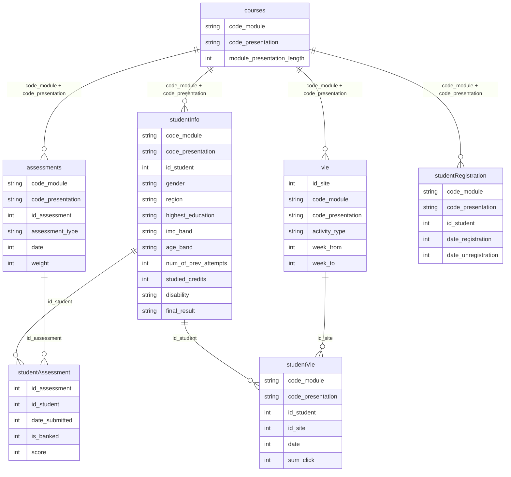

# Data Export & OULAD

SynthEd produces two export formats: a **standard 4-table** research dataset and an
**OULAD-compatible 7-table** dataset that plugs directly into Educational Data Mining
(EDM) pipelines built for the Open University Learning Analytics Dataset.

Both exporters live in `synthed/data_output/`.

---

## Standard 4-Table Export

**File:** `synthed/data_output/exporter.py` -- `DataExporter`

Called by `pipeline.run()` via `exporter.export_all()`. Skipped when
`_calibration_mode=True` (no `output_dir`).

### students.csv

Persona attributes organized by Rovai's (2003) four factor clusters.

| Column group | Columns |
|-------------|---------|
| **Identity** | `student_id`, `display_id`, `name`, `age`, `gender` |
| **Big Five** | `openness`, `conscientiousness`, `extraversion`, `agreeableness`, `neuroticism` |
| **Cluster 1: Student Characteristics** (Tinto, Kember) | `prior_gpa`, `prior_education_level`, `years_since_last_education`, `enrolled_courses`, `goal_commitment`, `ode_beliefs`, `motivation_type`, `goal_orientation` |
| **Cluster 2: Student Skills** (Rovai, Moore) | `digital_literacy`, `self_regulation`, `time_management`, `learner_autonomy`, `academic_reading_writing`, `has_reliable_internet`, `disability_severity`, `device_type`, `preferred_learning_style` |
| **Cluster 3: External Factors** (Bean & Metzner) | `is_employed`, `weekly_work_hours`, `has_family_responsibilities`, `financial_stress`, `socioeconomic_level`, `perceived_cost_benefit` |
| **Cluster 4: Internal Factors** (Tinto, Rovai) | `academic_integration`, `social_integration`, `institutional_support_access`, `self_efficacy` |
| **Derived** | `base_engagement_probability`, `base_dropout_risk` |
| **LLM** | `backstory` (empty unless `--llm` flag used) |

> These are **pre-simulation** values from `StudentPersona`. For evolved/final values,
> see `outcomes.csv`.

### interactions.csv

Timestamped LMS interaction logs -- one row per interaction event.

| Column | Source | Notes |
|--------|--------|-------|
| `student_id` | `InteractionRecord.student_id` | Internal UUID |
| `display_id` | Lookup from `StudentPersona.display_id` | Human-readable `S-0001` |
| `week` | `InteractionRecord.week` | Simulation week (1-indexed) |
| `course_id` | `InteractionRecord.course_id` | Course identifier |
| `interaction_type` | `InteractionRecord.interaction_type` | `lms_login`, `forum_read`, `forum_post`, `assignment_submit`, `exam`, `live_session` |
| `timestamp_offset_hours` | `InteractionRecord.timestamp_offset_hours` | Hours offset within the week |
| `duration_minutes` | `InteractionRecord.duration_minutes` | Activity duration |
| `quality_score` | `InteractionRecord.quality_score` | 0-1 scale; empty if 0 |
| `device` | `InteractionRecord.metadata["device"]` | Device type |
| `is_late` | `InteractionRecord.metadata["is_late"]` | Late submission flag |
| `exam_type` | `InteractionRecord.metadata["exam_type"]` | `midterm` or `final` |
| `post_length` | `InteractionRecord.metadata["post_length"]` | Forum post word count |

### outcomes.csv

Per-student final state after simulation. Includes theory module outputs.

| Column | Source | Notes |
|--------|--------|-------|
| `student_id`, `display_id` | Persona identity | |
| `has_dropped_out` | `SimulationState.has_dropped_out` | 0 or 1 |
| `dropout_week` | `SimulationState.dropout_week` | Empty if completed |
| `withdrawal_reason` | `SimulationState.withdrawal_reason` | One of 7 event codes from `UnavoidableWithdrawal._EVENT_WEIGHTS`: `serious_illness`, `family_emergency`, `forced_relocation`, `career_change`, `military_deployment`, `death`, `legal_issues`; or empty if no withdrawal |
| `final_dropout_phase` | `SimulationState.dropout_phase` | Baulke phase 0-5 |
| `final_engagement` | Last value in `weekly_engagement_history` | |
| `final_gpa` | `SimulationState.cumulative_gpa` | Floor-adjusted transcript GPA |
| `final_academic_integration` | `SimulationState.academic_integration` | Tinto |
| `final_social_integration` | `SimulationState.social_integration` | Tinto |
| `final_perceived_cost_benefit` | `SimulationState.perceived_cost_benefit` | Kember |
| `courses_active_count` | `len(SimulationState.courses_active)` | |
| `engagement_trend` | Computed | `positive`/`negative`/`stable`/`unknown` |
| `final_social_presence` | `SimulationState.coi_state.social_presence` | Garrison CoI |
| `final_cognitive_presence` | `SimulationState.coi_state.cognitive_presence` | Garrison CoI |
| `final_teaching_presence` | `SimulationState.coi_state.teaching_presence` | Garrison CoI |
| `final_motivation_type` | `SimulationState.current_motivation_type` | SDT |
| `final_autonomy_need` | `SimulationState.sdt_needs.autonomy` | SDT |
| `final_competence_need` | `SimulationState.sdt_needs.competence` | SDT |
| `final_relatedness_need` | `SimulationState.sdt_needs.relatedness` | SDT |
| `final_exhaustion_level` | `SimulationState.exhaustion.exhaustion_level` | Gonzalez |
| `network_degree` | `SocialNetwork.get_degree()` | Epstein & Axtell |

**Engagement trend** calculation: divides weekly history into quarters; if the
mean of the last quarter exceeds the first quarter by > 0.05, trend is `positive`;
below -0.05 is `negative`; otherwise `stable`. Requires >= 4 weeks; otherwise `unknown`.

### weekly_engagement.csv

Wide-format engagement trajectories.

| Column | Description |
|--------|-------------|
| `student_id` | Internal UUID |
| `display_id` | Human-readable ID |
| `week_1` ... `week_N` | Engagement value (0-1) for each simulation week |

`max_weeks` is computed dynamically from the longest `weekly_engagement_history`
across all students.

---

## OULAD 7-Table Export

**File:** `synthed/data_output/oulad_exporter.py` -- `OuladExporter`

Produces CSV files matching the Open University Learning Analytics Dataset schema
(Kuzilek et al., 2017). Output goes to `{output_dir}/oulad/`.

### Table relationships

### Catalog tables (3)

#### courses.csv

One row per course per presentation.

| Column | Source |
|--------|--------|
| `code_module` | `Course.id` |
| `code_presentation` | `semester_to_presentation(environment.semester_name)` |
| `module_presentation_length` | `total_weeks * 7` (days) |

#### assessments.csv

Built by `_build_assessment_catalog()`. Creates entries for:

- **TMA (tutor-marked assignments):** One per `course.assignment_weeks` entry, weight = `100 / n_assignments`
- **Midterm as TMA:** If `midterm_week != final_week`, weight = 0
- **Final exam:** `assessment_type = "Exam"`, weight = 100, date = empty (OULAD convention)

Internal `_week` and `_type` fields are used for lookup but not exported.

#### vle.csv

One VLE site per interaction type per course. Activity types:

| Activity type | Always present |
|--------------|---------------|
| `homepage` | Yes |
| `forumng` | Yes |
| `oucontent` | Yes |
| `resource` | Yes |
| `subpage` | Yes |
| `oucollaborate` | Only if `course.has_live_sessions` |

### Student profile tables (2)

#### studentInfo.csv

One row per (student, course) combination -- this is the OULAD convention.

| Column | Mapping function | Notes |
|--------|-----------------|-------|
| `id_student` | `student_id_to_int(display_id)` | `"S-0001"` becomes `1` |
| `gender` | `gender_to_oulad(gender)` | `"male"` becomes `"M"`, else `"F"` |
| `region` | `select_region(rng)` | Weighted random from 13 UK regions |
| `highest_education` | `education_to_oulad(prior_education_level)` | See mapping table below |
| `imd_band` | `select_imd_band(rng, socioeconomic_level)` | SES-based band selection |
| `age_band` | `age_to_band(age)` | `0-35`, `35-55`, or `55<=` |
| `num_of_prev_attempts` | Hardcoded `0` | First attempt assumed |
| `studied_credits` | `enrolled_courses * 30` | Credits estimate |
| `disability` | `"Y"` if `disability_severity > 0` else `"N"` | |
| `final_result` | `map_final_result(...)` | See outcome mapping below |

**Education mapping** (`_EDUCATION_MAP`):

| SynthEd | OULAD |
|---------|-------|
| `high_school` | `A Level or Equivalent` |
| `associate` | `Lower Than A Level` |
| `bachelor` | `HE Qualification` |
| Other | `A Level or Equivalent` (fallback) |

**Final result mapping** (`map_final_result()`):

| Condition | Result |
|-----------|--------|
| `has_dropped_out` or `withdrawal_reason is not None` | `Withdrawn` |
| `gpa_count == 0` (completed, no grades) | `Pass` |
| `cumulative_gpa >= _FINAL_RESULT_DISTINCTION_GPA (3.4)` | `Distinction` |
| `cumulative_gpa >= _FINAL_RESULT_PASS_GPA (1.6)` | `Pass` |
| Otherwise | `Fail` |

**IMD band mapping** (`_IMD_BANDS_BY_SES`):

| Socioeconomic level | Possible IMD bands |
|---------------------|-------------------|
| `low` | `0-10%`, `10-20%`, `20-30%`, `30-40%` |
| `middle` | `40-50%`, `50-60%`, `60-70%`, `70-80%` |
| `high` | `80-90%`, `90-100%` |

#### studentRegistration.csv

| Column | Source |
|--------|--------|
| `date_registration` | Random integer in `[-180, -10]` (days before presentation start) |
| `date_unregistration` | `dropout_week * 7` if dropped out, else empty |

### Behavioral tables (2)

#### studentAssessment.csv

Graded interactions (assignments and exams) mapped via assessment catalog lookup.

| Column | Source |
|--------|--------|
| `id_assessment` | Lookup by `(course_id, week, interaction_type)` |
| `id_student` | `student_id_to_int(display_id)` |
| `date_submitted` | `(week - 1) * 7 + day_offset` (days from presentation start) |
| `is_banked` | Hardcoded `0` |
| `score` | `round(quality_score * 100)`, clamped to `[0, 100]` |

Only `assignment_submit` and `exam` interaction types are included.

#### studentVle.csv

Non-graded interactions mapped through VLE catalog and click heuristic.

| Column | Source |
|--------|--------|
| `id_site` | Lookup by `(course_id, activity_type)` |
| `id_student` | `student_id_to_int(display_id)` |
| `date` | `(week - 1) * 7 + day_offset` |
| `sum_click` | `click_heuristic(interaction_type, duration_minutes, metadata)` |

**Interaction type to activity type mapping** (`_ACTIVITY_TYPE_MAP`):

| SynthEd type | OULAD activity |
|-------------|----------------|
| `lms_login` | `homepage` |
| `forum_read` | `forumng` |
| `forum_post` | `forumng` |
| `live_session` | `oucollaborate` |
| `assignment_submit` | `None` (goes to studentAssessment) |
| `exam` | `None` (goes to studentAssessment) |
| Other | `oucontent` (fallback) |

**Click heuristic** (`click_heuristic()`):

| Interaction type | Formula | Minimum |
|-----------------|---------|---------|
| `lms_login` | 1 (constant) | 1 |
| `forum_read` | `duration_minutes / 3` | 1 |
| `forum_post` | `post_length / 20` | 1 |
| `live_session` | `duration_minutes / 10` | 1 |
| Fallback | `duration_minutes / 5` | 1 |

---

## Validation Data Preparation

**File:** `synthed/pipeline.py` -- `SynthEdPipeline._prepare_validation_data()`

Before running the 21 validation tests, the pipeline computes additional fields
on the fly that are not stored in `SimulationState`:

| Computed field | Formula | Used by |
|---------------|---------|---------|
| `coi_composite` | `(social_presence + cognitive_presence + teaching_presence) / 3` | Correlation validation |
| `network_degree` | `SocialNetwork.get_degree(student_id)` | Correlation validation |

These fields enable the validator to test theory-predicted correlations (e.g.,
CoI composite vs. engagement, network degree vs. social integration) without
requiring the engine to store redundant derived values.

---

## Gotchas

1. **student_id vs display_id** -- Internal `student_id` is a UUID (non-deterministic,
   embeds wall-clock time via UUIDv7). `display_id` (`S-0001`) is sequential and
   deterministic. OULAD export converts `display_id` to integer via
   `student_id_to_int()`. Standard export includes both.

2. **Pre-simulation vs post-simulation values** -- `students.csv` contains
   **initial** persona values (before simulation). `outcomes.csv` contains **final**
   evolved values. Do not compare `students.csv.academic_integration` directly with
   `outcomes.csv.final_academic_integration` -- they measure different time points.

3. **One row per (student, course) in OULAD** -- `studentInfo.csv` and
   `studentRegistration.csv` produce one row per student per course, matching
   OULAD convention. A simulation with 200 students and 1 course produces 200 rows;
   with 2 courses, 400 rows.

4. **Region and IMD are synthetic** -- OULAD uses UK regions and IMD (Index of
   Multiple Deprivation) bands. SynthEd generates these stochastically using
   OULAD-observed distributions (`_REGION_WEIGHTS`). They are not derived from
   student persona traits beyond `socioeconomic_level`.

5. **Assessment weight rounding** -- TMA weights are `round(100 / n_assignments)`.
   With 3 assignments this gives 33 per TMA (total 99, not 100). This matches
   OULAD's real data where weights do not always sum to 100.

6. **Click heuristic is lossy** -- Converting duration-based interactions to click
   counts is inherently approximate. Forum reads at 3 minutes each become 1 click
   per 3 minutes of reading. The heuristic was calibrated against OULAD's observed
   click distributions but is not exact.

7. **Calibration mode skips export** -- When `_calibration_mode=True`, both
   `DataExporter` and `OuladExporter` are skipped entirely. The pipeline extracts
   only summary metrics (`dropout_rate`, `mean_engagement`, `mean_gpa`) for the
   calibrator. No CSV files are written.

8. **Registration dates are random** -- `date_registration` is drawn uniformly from
   `[-180, -10]` days before presentation start. This models early registration
   behavior observed in OULAD but is not derived from any student attribute.

---

## Related Pages

- [Pipeline Walkthrough](pipeline-walkthrough.md) -- where export fits in the pipeline stages
- [Grading & GPA System](grading-and-gpa.md) -- how `cumulative_gpa` and `semester_grade` are computed before export
- [Calibration & Sensitivity Analysis](calibration-and-analysis.md) -- OULAD validation that consumes exported-format data
- [Theory Module Reference](theory-modules.md) -- theory outputs that appear in outcomes.csv
- [Simulation Loop](simulation-loop.md) -- how interaction records are generated
