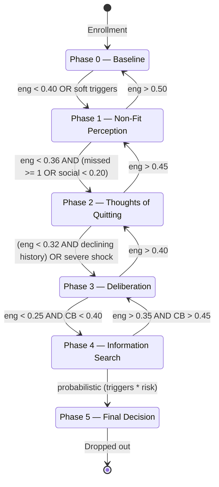

# Dropout Mechanics

SynthEd models dropout through three independent mechanisms:

1. **Baulke 6-phase model** -- gradual disengagement following Baeulke et al. (2022)
2. **Unavoidable withdrawal** -- catastrophic life events bypassing the phase model
3. **Dropout contagion** -- peer influence accelerating disengagement (Epstein & Axtell, 1996)

This page documents the exact thresholds and transition logic from the source code.

---

## Baulke 6-Phase Model

Source: `synthed/simulation/theories/baulke.py` -- class `BaulkeDropoutPhase`

The model traces a student from baseline enrollment through increasingly serious
disengagement phases. Each phase has forward transitions (toward dropout), recovery
transitions (back toward engagement), and specific threshold conditions.

### Phase State Machine



### Phase 0 -> 1: Non-Fit Perception

The student senses incongruence with the program. This is the first signal of disengagement.

**Triggers** (any one is sufficient):

| Trigger | Condition | Constants |
|---------|-----------|-----------|
| Low engagement | `eng < 0.40` | `_NONFIT_ENG_THRESHOLD` = 0.40 |
| Soft: low cognitive presence | `eng < 0.45 AND coi.cognitive_presence < 0.25` | `_NONFIT_ENG_SOFT` = 0.45, `_NONFIT_COG_THRESHOLD` = 0.25 |
| Soft: high transactional distance | `eng < 0.45 AND avg_td > 0.55` | `_NONFIT_ENG_SOFT` = 0.45, `_NONFIT_TD_THRESHOLD` = 0.55 |
| Soft: high exhaustion | `eng < 0.45 AND exhaustion > 0.70` | `_NONFIT_ENG_SOFT` = 0.45, `_EXHAUSTION_THRESHOLD` = 0.70 |
| Soft: low perceived mastery | `eng < 0.45 AND perceived_mastery < 0.40 AND mastery_count >= 2` | `_NONFIT_ENG_SOFT` = 0.45, `_NONFIT_MASTERY_THRESHOLD` = 0.40, `_NONFIT_GPA_MIN_ITEMS` = 2 |

> **CRITICAL**: The mastery trigger uses `state.perceived_mastery` (raw quality average)
> compared against `_NONFIT_MASTERY_THRESHOLD` (0.40). It does **NOT** use `cumulative_gpa` or
> `_NONFIT_GPA_THRESHOLD` (1.6). The `_NONFIT_GPA_THRESHOLD` constant exists in the code but
> is **dead code** -- no logic references it for phase transitions. See
> [grading-and-gpa.md](grading-and-gpa.md) for the dual-track GPA explanation.

### Phase 1 -> 0: Recovery

| Condition | Constant |
|-----------|----------|
| `eng > 0.50` | `_RECOVERY_1_TO_0` = 0.50 |

Recovery adds a positive memory event with impact +0.2 (`_IMPACT_RECOVERY_1_TO_0`).

### Phase 1 -> 2: Thoughts of Quitting

The student begins unsystematic consideration of alternatives.

| Condition | Constants |
|-----------|-----------|
| `eng < 0.36` **AND** (`missed_assignments_streak >= 1` **OR** `social_integration < 0.20`) | `_PHASE_1_TO_2_ENG` = 0.36, `_PHASE_1_SOCIAL_THRESHOLD` = 0.20 |

Both conditions must be met: low engagement **plus** at least one of the secondary triggers.

### Phase 2 -> 1: Recovery

| Condition | Constant |
|-----------|----------|
| `eng > 0.45` | `_RECOVERY_2_TO_1` = 0.45 |

### Phase 2 -> 3: Deliberation

The student consciously weighs pros and cons of staying vs leaving.

**Two independent paths** (either is sufficient):

| Path | Condition | Constants |
|------|-----------|-----------|
| Sustained decline | `eng < 0.32 AND len(history) >= 2 AND history[-1] < history[-2]` | `_PHASE_2_TO_3_ENG` = 0.32 |
| Severe shock | `env_shock_remaining > 0 AND env_shock_magnitude > 0.70` | `_SHOCK_SEVERITY_THRESHOLD` = 0.70 |

> **Gotcha -- declining-history guard**: The engagement path requires `history[-1] < history[-2]`,
> meaning the most recent engagement must be **lower** than the previous week. A student stuck at
> constant low engagement (e.g., 0.30 every week) will NOT advance to Phase 3 via this path.
> Only a declining trend or a severe shock triggers deliberation.

### Phase 3 -> 2: Recovery

| Condition | Constant |
|-----------|----------|
| `eng > 0.40` | `_RECOVERY_3_TO_2` = 0.40 |

### Phase 3 -> 4: Information Search

The student actively explores alternatives to the current program.

| Condition | Constants |
|-----------|-----------|
| `eng < 0.25 AND perceived_cost_benefit < 0.40` | `_PHASE_3_TO_4_ENG` = 0.25, `_PHASE_3_TO_4_CB` = 0.40 |

Both conditions must be met. This is where Kember's cost-benefit analysis becomes gate-keeping.

### Phase 4 -> 3: Recovery

| Condition | Constants |
|-----------|-----------|
| `eng > 0.35 AND perceived_cost_benefit > 0.45` | `_RECOVERY_4_TO_3_ENG` = 0.35, `_RECOVERY_4_TO_3_CB` = 0.45 |

Both conditions must be met for recovery at this late stage.

### Phase 4 -> 5: Final Decision

This is the only probabilistic transition. The student accumulates triggers, and the probability
of dropout scales with the number of active triggers.

**Trigger checklist:**

| # | Trigger | Condition | Constant |
|---|---------|-----------|----------|
| 1 | Near-zero engagement | `eng < 0.10` | `_TRIGGER_ENG_THRESHOLD` = 0.10 |
| 2 | Academic failure cascade | `missed_assignments_streak >= 3` | `_TRIGGER_MISSED_STREAK` = 3 |
| 3 | Economic rationality | `perceived_cost_benefit < 0.15` | `_TRIGGER_CB_THRESHOLD` = 0.15 |
| 4 | Environmental crisis | `financial_stress > 0.70` | `_TRIGGER_FINANCIAL_THRESHOLD` = 0.70 |
| 5 | Academic exhaustion | `exhaustion > 0.70` | `_EXHAUSTION_THRESHOLD` = 0.70 |
| 6 | Academic failure (mastery) | `perceived_mastery < 0.30 AND mastery_count >= 2` | `_TRIGGER_MASTERY_THRESHOLD` = 0.30, `_TRIGGER_GPA_MIN_ITEMS` = 2 |
| 7 | Withdrawal deadline | `week == int(total_weeks * 0.70)` | `_WITHDRAWAL_WEEK_FRACTION` = 0.70 |

**Decision probability formula:**

```
decision_prob = base_dropout_risk * triggers * _DECISION_RISK_MULTIPLIER
```

Where:
- `base_dropout_risk` comes from `StudentPersona.base_dropout_risk` (persona-level)
- `triggers` is the count of active triggers (1-7)
- `_DECISION_RISK_MULTIPLIER` = 0.28

If `rng.random() < decision_prob`, the student drops out.

**Example**: A student with `base_dropout_risk = 0.3` and 3 active triggers:
`0.3 * 3 * 0.28 = 0.252` -- about 25% chance of dropping out this week.

---

## Recovery Path Summary

Every phase except Phase 5 has a recovery path. Recovery thresholds decrease as phases advance,
reflecting the increasing difficulty of re-engagement.

| Transition | Engagement Threshold | Additional Condition |
|------------|---------------------|---------------------|
| 1 -> 0 | > 0.50 | -- |
| 2 -> 1 | > 0.45 | -- |
| 3 -> 2 | > 0.40 | -- |
| 4 -> 3 | > 0.35 | CB > 0.45 |

The decreasing threshold pattern (0.50 -> 0.45 -> 0.40 -> 0.35) means recovery requires
progressively less engagement at later phases, but by Phase 4, cost-benefit must also recover.

---

## Exhaustion as Accelerator

Source: `synthed/simulation/theories/academic_exhaustion.py` -- class `GonzalezExhaustion`

Gonzalez exhaustion interacts with Baulke at two points:

1. **Phase 0 -> 1 soft trigger**: When `eng < 0.45` (soft threshold) AND `exhaustion > 0.70`
   (`_EXHAUSTION_THRESHOLD`), the student enters Phase 1 even if engagement alone would not trigger it.

2. **Phase 4 -> 5 trigger**: Exhaustion above `_DROPOUT_THRESHOLD` (0.70 in `GonzalezExhaustion`)
   counts as one of the probabilistic triggers for the final decision.

The `exhaustion_accelerates_dropout()` method returns `True` when `exhaustion_level > 0.70`.

---

## Unavoidable Withdrawal

Source: `synthed/simulation/theories/unavoidable_withdrawal.py` -- class `UnavoidableWithdrawal`

This is a separate mechanism that models catastrophic life events. It runs **before** any
interactions are generated for a student each week and **bypasses the Baulke phase model entirely**.

**Configuration:**
- `per_semester_probability`: configured at engine initialization (default: 0.0)
- Converted to weekly probability: `p_week = 1 - (1 - p_semester)^(1/N)`

**When triggered:**
- `state.has_dropped_out = True`
- `state.dropout_week = week`
- `state.withdrawal_reason` = one of the weighted event types
- Memory entry appended with impact = -1.0

**Event type distribution:**

| Event | Weight |
|-------|--------|
| Serious illness | 0.30 |
| Family emergency | 0.20 |
| Forced relocation | 0.15 |
| Career change | 0.15 |
| Military deployment | 0.10 |
| Death | 0.05 |
| Legal issues | 0.05 |

**Key distinction from Baulke**: Unavoidable withdrawal ignores engagement, motivation, GPA,
and all other simulation state. It is purely stochastic with persona-independent probability.
The `withdrawal_reason` field on `SimulationState` distinguishes these from phase-model dropouts.

---

## Dropout Contagion

Source: `synthed/simulation/theories/epstein_axtell.py` -- class `EpsteinAxtellPeerInfluence`

When a student's network neighbor drops out (or enters late dropout phases), the remaining
student's engagement is penalized. This models the social contagion effect described in
Epstein & Axtell (1996).

The contagion operates through `SocialNetwork.dropout_contagion()`:
- Scans the student's network neighbors
- For each neighbor in a dropout phase (or who has dropped out), applies a penalty
- The penalty reduces `current_engagement`, clipped to `[_ENGAGEMENT_CLIP_LO, _ENGAGEMENT_CLIP_HI]`

This runs in **Phase 2** of the weekly loop, after all individual updates are complete.

---

## Withdrawal Deadline

The constant `_WITHDRAWAL_WEEK_FRACTION` (0.70) determines the withdrawal deadline at approximately
70% through the semester. For a 14-week semester: `int(14 * 0.70) = 9`, so week 9.

At the withdrawal deadline week, an additional trigger fires for Phase 4 -> 5, reflecting
the institutional deadline pressure described by Kember (1989).

Students who drop out **after** this week may be marked differently in downstream processing
(see [data-export.md](data-export.md) for how dropout timing affects export records).

---

## Memory System

Each phase transition and recovery appends a memory entry to `SimulationState.memory`:

```python
{
    "week": int,
    "event_type": "dropout_phase" | "recovery" | "dropout" | "unavoidable_withdrawal",
    "details": str,  # Human-readable description
    "impact": float  # Negative for phase advances, positive for recovery
}
```

**Impact values** (`_IMPACT_*` constants):

| Transition | Impact |
|------------|--------|
| Phase 0 -> 1 (non-fit) | -0.2 |
| Phase 1 -> 0 (recovery) | +0.2 |
| Phase 1 -> 2 (thoughts) | -0.25 |
| Phase 2 -> 1 (recovery) | +0.15 |
| Phase 2 -> 3 (deliberation) | -0.3 |
| Phase 3 -> 2 (recovery) | +0.1 |
| Phase 3 -> 4 (info search) | -0.4 |
| Phase 4 -> 5 (dropout) | -0.8 |
| Unavoidable withdrawal | -1.0 |

> **Note**: These memory entries are currently logged but **not used for decision-making**.
> The memory system is a record-keeping facility, not a feedback mechanism.

---

## Gotchas

- **`_NONFIT_GPA_THRESHOLD` is dead code**: The constant `_NONFIT_GPA_THRESHOLD = 1.6` exists in
  `BaulkeDropoutPhase` but is never referenced in `advance_phase()`. Phase 0 -> 1 uses
  `_NONFIT_MASTERY_THRESHOLD` (0.40) against `perceived_mastery`, not `cumulative_gpa`. If you
  grep for `_NONFIT_GPA_THRESHOLD`, you will find only its definition -- no usage.

- **Phase advancement happens in Phase 2**: Baulke's `advance_phase()` is called in the social
  phase of the weekly loop (after peer influence, after engagement history is recorded). This means
  the engagement value used for phase transitions **includes** peer contagion effects.

- **One phase step per week maximum**: The code uses `elif` chains, so a student can only advance
  or recover by one phase per week. A student cannot jump from Phase 0 to Phase 3 in a single week.

- **Declining history requires >= 2 entries**: Phase 2 -> 3 via the engagement path requires
  `len(history) >= 2 AND history[-1] < history[-2]`. In week 1, history has only 1 entry, so
  this path is impossible. The earliest Phase 2 -> 3 via engagement can occur is week 3 (Phase 0 -> 1
  in week 1, Phase 1 -> 2 in week 2, Phase 2 -> 3 in week 3 if history is declining).

- **Operator precedence in Phase 2 -> 3**: The code reads
  `eng < 0.32 and len(history) >= 2 and history[-1] < history[-2] or (shock...)`. Due to Python's
  `and`/`or` precedence, this is `(eng_path) or (shock_path)` -- either the sustained-decline path
  OR the severe-shock path triggers the transition.

- **Withdrawal reason distinguishes dropout types**: `state.withdrawal_reason` is set only by
  `UnavoidableWithdrawal`. Baulke phase-model dropouts have `withdrawal_reason = None`. Use this
  field to distinguish the two mechanisms in exported data.

- **`base_dropout_risk` is persona-level**: The risk multiplier in Phase 4 -> 5 comes from the
  student's persona, not from simulation state. High-risk personas have structurally higher dropout
  probability even with identical engagement trajectories.

---

*See also: [theory-modules.md](theory-modules.md) for all 11 modules, [simulation-loop.md](simulation-loop.md) for when Baulke fires in the weekly loop, [grading-and-gpa.md](grading-and-gpa.md) for the dual-track GPA system.*
