# Engagement Update Formula

This page decomposes `_update_engagement()` in `synthed/simulation/engine.py` term by term. For the overall simulation flow, see [Simulation Loop](simulation-loop.md). For which theory modules update state before this formula runs, see [Theory Module Reference](theory-modules.md).

---

## Overview

`_update_engagement()` is the multi-theory engagement composer. It runs once per student per week, during Phase 1, after all theory modules have updated their respective state variables. It reads state from all theory modules and computes a new `current_engagement` value.

The formula is additive: it starts from the current engagement, applies a series of positive and negative adjustments, then clips to [`_ENGAGEMENT_CLIP_LO` (0.01), `_ENGAGEMENT_CLIP_HI` (0.99)].

---

## Engagement Waterfall Diagram

The diagram below shows the additive/subtractive contributions of each term for a typical student at week 7. Signs indicate direction of effect; actual magnitudes depend on student state.

```mermaid
flowchart LR
    E0["Current<br/>Engagement"] --> T1
    T1["+/- Tinto<br/>Integration"] --> T2
    T2["- Bean & Metzner<br/>Env. Pressure"] --> T3
    T3["-/0 Env. Shock<br/>(stochastic)"] --> T4
    T4["+/0 Positive<br/>Event"] --> T5
    T5["+ Rovai<br/>Regulation Buffer"] --> T6
    T6["+/- SDT<br/>Motivation Type"] --> T7
    T7["+/- Moore<br/>TD Effect"] --> T8
    T8["+/- Garrison<br/>CoI Effect"] --> T9
    T9["- Gonzalez<br/>Exhaustion Drag"] --> T10
    T10["+/- Academic<br/>Outcome Bonus"] --> T11
    T11["-/0 Missed Assign.<br/>Streak Penalty"] --> T12
    T12["-/0 Exam Week<br/>Neuro. Stress"] --> T13
    T13["+/- Kember<br/>Cost-Benefit"] --> T14
    T14["max(Rovai Floor)"] --> T15
    T15["clip to<br/>[0.01, 0.99]"]

    style E0 fill:#e3f2fd
    style T15 fill:#e8f5e9
```



---

## Term-by-Term Breakdown

### Term 1: Adaptive Baseline Decay

```
decay_attenuation = 1 / (1 + _DECAY_DAMPING_FACTOR * sqrt(week - 1))
```

| Variable | Source | Default |
|----------|--------|---------|
| `_DECAY_DAMPING_FACTOR` | `EngineConfig` | 0.5 |

**What it does:** The decay attenuation factor decreases over time, making the Tinto decay term (Term 2) weaker in later weeks. At week 1: `1.0`. At week 7: `1 / (1 + 0.5 * sqrt(6))` = ~0.55. At week 14: `1 / (1 + 0.5 * sqrt(13))` = ~0.36.

**Magnitude:** This is a multiplier on the Tinto decay, not a direct engagement change.

---

### Term 2: Tinto Integration Effect

```
integration_effect = academic_integration * _TINTO_ACADEMIC_WEIGHT
                   + social_integration * _TINTO_SOCIAL_WEIGHT
                   - _TINTO_DECAY_BASE * decay_attenuation
```

| Variable | Source | Default |
|----------|--------|---------|
| `_TINTO_ACADEMIC_WEIGHT` | `EngineConfig` | 0.06 |
| `_TINTO_SOCIAL_WEIGHT` | `EngineConfig` | 0.02 |
| `_TINTO_DECAY_BASE` | `EngineConfig` | 0.05 |
| `academic_integration` | `SimulationState` | Evolves via `tinto.update_integration()` |
| `social_integration` | `SimulationState` | Evolves via `tinto.update_integration()` |

**What it does:** Higher academic and social integration boost engagement, while a baseline decay pulls it down. The decay weakens over time via `decay_attenuation`.

**Typical magnitude:** With both integrations at 0.5 and week 7 decay: `0.5 * 0.06 + 0.5 * 0.02 - 0.05 * 0.55` = `0.03 + 0.01 - 0.0275` = **+0.0125**. This term is near-zero or slightly positive for average students; strongly positive for well-integrated students.

---

### Term 3: Bean & Metzner Environmental Pressure

```
engagement += bean_metzner.calculate_environmental_pressure(student, state.coping_factor)
```

Before this, `bean_metzner.update_coping(student, state)` adapts the coping factor.

| Variable | Source | Default |
|----------|--------|---------|
| `coping_factor` | `SimulationState` | 0.0, grows over time (max 0.5) |
| `financial_stress` | `StudentPersona` | Varies |
| `is_employed` | `StudentPersona` | Varies |

**What it does:** Environmental pressure from employment, financial stress, and family obligations erodes engagement. Coping develops over time and attenuates the pressure. Employed students with high financial stress feel the largest penalty.

**Typical magnitude:** Ranges from ~0 (low-stress, adapted student) to approximately **-0.04** (high-stress employed student early in semester).

---

### Term 4: Environmental Shocks (Stochastic)

```
if env_shock_remaining > 0:
    engagement -= env_shock_magnitude * 0.05
    # decrement remaining weeks
else:
    # roll for new shock via bean_metzner.stochastic_pressure_event()
    if triggered:
        engagement -= magnitude * 0.05
```

| Variable | Source |
|----------|--------|
| `env_shock_remaining` | `SimulationState` |
| `env_shock_magnitude` | `SimulationState` |

**What it does:** Acute life events (medical emergency, family crisis) cause a multi-week engagement penalty. Magnitude and duration are stochastic, drawn from the Bean & Metzner module.

**Typical magnitude:** When active, **-0.01 to -0.05** per week depending on shock severity. Most weeks: 0 (no active shock).

---

### Term 5: Positive Events

```
engagement += positive_events.apply(context["positive_event"], student, state)
```

| Variable | Source |
|----------|--------|
| `positive_event` | `ODLEnvironment.positive_events` dict (week-keyed) |

**What it does:** Counter-pressure from positive environmental events (orientation welcome, financial aid disbursement, semester break, peer study group). Only fires on specific weeks defined in `ODLEnvironment`.

**Typical magnitude:** **+0.01 to +0.03** on event weeks; 0 on other weeks.

---

### Term 6: Rovai Self-Regulation Buffer

```
engagement += rovai.regulation_buffer(student)
```

| Variable | Source |
|----------|--------|
| `self_regulation` | `StudentPersona` |

**What it does:** Students with higher self-regulation get a small weekly engagement buffer. This models Rovai's persistence factor — self-regulated students are more consistent.

**Typical magnitude:** **+0.005 to +0.02** depending on `self_regulation` score.

---

### Term 7: SDT Motivation Type Effect

```
motivation_effect = {
    "intrinsic":  +_MOTIVATION_INTRINSIC_BOOST,
    "extrinsic":   0.0,
    "amotivation": -_MOTIVATION_AMOTIVATION_PENALTY,
}[current_motivation_type]
```

| Variable | Source | Default |
|----------|--------|---------|
| `_MOTIVATION_INTRINSIC_BOOST` | `EngineConfig` | 0.02 |
| `_MOTIVATION_AMOTIVATION_PENALTY` | `EngineConfig` | 0.025 |
| `current_motivation_type` | `SimulationState` | Shifts via `sdt.evaluate_motivation_shift()` |

**What it does:** Intrinsically motivated students get a weekly boost; amotivated students get a penalty; extrinsic is neutral. Motivation type can shift across weeks based on SDT need satisfaction.

**Typical magnitude:** **+0.02** (intrinsic), **0** (extrinsic), **-0.025** (amotivation). Fixed per-week effect.

---

### Term 8: Moore Transactional Distance Effect

```
avg_td = moore.average(student, state, self.env)
td_effect = -(avg_td - 0.5) * _TD_EFFECT_FACTOR
```

| Variable | Source | Default |
|----------|--------|---------|
| `_TD_EFFECT_FACTOR` | `EngineConfig` | 0.03 |
| `avg_td` | Computed from `Course` fields + `student.learner_autonomy` | Varies |

**What it does:** Higher transactional distance (high structure, low dialogue, low autonomy) penalizes engagement. The effect is centered at 0.5 — courses with balanced TD have no effect.

**Typical magnitude:** **-0.015 to +0.015**. The range is `0.03 * 0.5` = 0.015 in either direction from neutral.

---

### Term 9: Garrison CoI Effect

```
coi_effect = social_presence * _COI_SOCIAL_WEIGHT
           + cognitive_presence * _COI_COGNITIVE_WEIGHT
           + teaching_presence * _COI_TEACHING_WEIGHT
           - _COI_BASELINE_OFFSET
```

| Variable | Source | Default |
|----------|--------|---------|
| `_COI_SOCIAL_WEIGHT` | `EngineConfig` | 0.01 |
| `_COI_COGNITIVE_WEIGHT` | `EngineConfig` | 0.02 |
| `_COI_TEACHING_WEIGHT` | `EngineConfig` | 0.01 |
| `_COI_BASELINE_OFFSET` | `EngineConfig` | 0.02 |
| `social_presence` | `CommunityOfInquiryState` | Initial 0.3 |
| `cognitive_presence` | `CommunityOfInquiryState` | Initial 0.4 |
| `teaching_presence` | `CommunityOfInquiryState` | Initial 0.5 (from `inst.teaching_presence_baseline`) |

**What it does:** The three presences contribute positively, offset by a baseline. When all presences are at their initial values: `0.3 * 0.01 + 0.4 * 0.02 + 0.5 * 0.01 - 0.02` = `0.003 + 0.008 + 0.005 - 0.02` = **-0.004**. The offset ensures CoI must be built up through interaction to provide positive engagement effects.

**Typical magnitude:** **-0.005 to +0.01** depending on presence levels.

---

### Term 10: Gonzalez Exhaustion Drag

```
engagement += gonzalez.exhaustion_engagement_effect(state)
```

| Variable | Source |
|----------|--------|
| `exhaustion.exhaustion_level` | `ExhaustionState` |

**What it does:** Higher exhaustion drags engagement down. The effect is computed by the Gonzalez module based on `exhaustion_level`.

**Typical magnitude:** **-0.03 to 0** depending on exhaustion level. Heavily loaded students late in the semester feel this most.

---

### Term 11: Academic Outcome Bonuses/Penalties

```
for each assignment_submit or exam record this week:
    if quality_score > _HIGH_QUALITY_THRESHOLD:  engagement += _HIGH_QUALITY_BOOST
    if quality_score < _LOW_QUALITY_THRESHOLD:    engagement -= _LOW_QUALITY_PENALTY
```

| Variable | Source | Default |
|----------|--------|---------|
| `_HIGH_QUALITY_THRESHOLD` | `EngineConfig` | 0.7 |
| `_HIGH_QUALITY_BOOST` | `EngineConfig` | 0.025 |
| `_LOW_QUALITY_THRESHOLD` | `EngineConfig` | 0.3 |
| `_LOW_QUALITY_PENALTY` | `EngineConfig` | 0.035 |

**What it does:** Good performance this week boosts engagement; poor performance penalizes it. Each graded item applies independently.

**Typical magnitude:** **+0.025** per high-quality item, **-0.035** per low-quality item. On exam weeks with 4 courses, a strong student might get 4 * 0.025 = **+0.10** — a significant swing.

---

### Term 12: Missed Assignment Streak Penalty

```
if missed_assignments_streak >= 2:
    engagement -= _MISSED_STREAK_PENALTY * min(streak - 1, _MISSED_STREAK_CAP)
```

| Variable | Source | Default |
|----------|--------|---------|
| `_MISSED_STREAK_PENALTY` | `EngineConfig` | 0.04 |
| `_MISSED_STREAK_CAP` | `EngineConfig` | 3 |

**What it does:** Consecutive missed assignments compound the penalty. Streak of 2: `0.04 * 1` = **-0.04**. Streak of 3: `0.04 * 2` = **-0.08**. Streak of 4+: `0.04 * 3` = **-0.12** (capped).

**Typical magnitude:** 0 for most students; **-0.04 to -0.12** for students who stop submitting.

---

### Term 13: Exam Week Neuroticism Stress

```
if is_exam_week:
    engagement -= neuroticism * _NEUROTICISM_EXAM_FACTOR
```

| Variable | Source | Default |
|----------|--------|---------|
| `_NEUROTICISM_EXAM_FACTOR` | `EngineConfig` | 0.04 |
| `neuroticism` | `StudentPersona.personality` | Varies (0-1) |

**What it does:** High-neuroticism students suffer an engagement penalty during exam weeks (midterm and final). Low-neuroticism students barely feel it.

**Typical magnitude:** **-0.02** (average neuroticism) to **-0.04** (high neuroticism) during exam weeks; 0 otherwise.

---

### Term 14: Kember Cost-Benefit Recalculation and Feedback

```
# Triggered when: is_exam_week OR missed_streak >= 2 OR has graded item this week
kember.recalculate(student, state, context, records, avg_td, ...)
engagement += (perceived_cost_benefit - 0.5) * _CB_FEEDBACK_FACTOR
```

| Variable | Source | Default |
|----------|--------|---------|
| `_CB_FEEDBACK_FACTOR` | `EngineConfig` | 0.02 |
| `perceived_cost_benefit` | `SimulationState` | Initial from persona, evolves via Kember |

**What it does:** After major events (exams, missed assignments, any graded item), Kember's cost-benefit perception is recalculated. The updated perception feeds back into engagement. Students who perceive the cost outweighing benefits (`perceived_cost_benefit < 0.5`) get a penalty; the opposite get a boost.

**Typical magnitude:** **-0.01 to +0.01**. This is a small but persistent effect that accumulates over time. The real impact of Kember is through its influence on `perceived_cost_benefit`, which is read by [Dropout Mechanics](dropout-mechanics.md).

---

### Term 15: Rovai Engagement Floor

```
engagement = max(engagement, rovai.engagement_floor(student))
```

**What it does:** Sets a persona-dependent lower bound on engagement. High self-regulation and goal commitment students have a higher floor, preventing their engagement from collapsing completely.

---

### Term 16: Final Clip

```
state.current_engagement = clip(engagement, _ENGAGEMENT_CLIP_LO, _ENGAGEMENT_CLIP_HI)
```

| Variable | Source | Default |
|----------|--------|---------|
| `_ENGAGEMENT_CLIP_LO` | `EngineConfig` | 0.01 |
| `_ENGAGEMENT_CLIP_HI` | `EngineConfig` | 0.99 |

**What it does:** Hard bounds prevent engagement from reaching exactly 0 or 1.

---

## `InstitutionalConfig` and `scale_by()`

Several terms above are modulated by `InstitutionalConfig` via `scale_by()`:

```python
scale_by(constant, inst_param) = constant * (0.7 + 0.6 * inst_param)
```

At `inst_param = 0.5` (default), `scale_by` returns `constant * 1.0` — no effect.
At `inst_param = 0.0`, returns `constant * 0.7` — 30% reduction.
At `inst_param = 1.0`, returns `constant * 1.3` — 30% increase.

**Which terms are affected:**

| Term | InstitutionalConfig Parameter | What is scaled |
|------|-------------------------------|----------------|
| LMS login floor | `technology_quality` | `_LOGIN_LITERACY_FLOOR` |
| Forum read floor | `technology_quality` | `_FORUM_READ_LITERACY_FLOOR` |
| Assignment quality | `instructional_design_quality` | `_ASSIGN_GPA_WEIGHT`, `_ASSIGN_ENG_WEIGHT` |
| Exam quality | `instructional_design_quality` | `_EXAM_GPA_WEIGHT`, `_EXAM_ENG_WEIGHT` |
| Gonzalez exhaustion | `support_services_quality`, `curriculum_flexibility` | Recovery and load weights |
| Kember recalculation | `instructional_design_quality` | Quality factor in cost-benefit |
| CoI teaching_presence | `teaching_presence_baseline` | Initial value (direct, not via `scale_by`) |

---

## Example Scenarios

### Scenario A: High-Risk Employed Student at Week 7

Student profile: employed, high financial stress (0.8), low self-regulation (0.3), extrinsic motivation, neuroticism 0.7.

| Term | Contribution | Notes |
|------|-------------|-------|
| Tinto integration | +0.005 | Low academic (0.3) and social (0.2) integration |
| Bean & Metzner | -0.035 | High environmental pressure, partial coping |
| Env. shock | 0 | No active shock this week |
| Positive event | 0 | Week 7 is midterm, no positive event scheduled |
| Rovai buffer | +0.005 | Low self-regulation |
| SDT motivation | 0 | Extrinsic = neutral |
| Moore TD | -0.008 | Slightly high transactional distance |
| Garrison CoI | -0.004 | Presences near initial values |
| Gonzalez exhaustion | -0.015 | Moderate exhaustion from workload |
| Academic outcomes | -0.035 | One low-quality midterm exam |
| Missed streak | -0.04 | Streak of 2 missed assignments |
| Exam stress | -0.028 | Neuroticism 0.7 * 0.04 |
| Kember feedback | -0.006 | Cost-benefit at 0.2 |
| **Net delta** | **-0.161** | **Substantial drop** |

Starting from engagement 0.40, this student would drop to ~0.24 — putting them on a fast track through Baulke phases.

### Scenario B: Motivated Self-Regulated Student at Week 7

Student profile: not employed, low financial stress (0.2), high self-regulation (0.8), intrinsic motivation, neuroticism 0.3.

| Term | Contribution | Notes |
|------|-------------|-------|
| Tinto integration | +0.04 | High academic (0.7) and social (0.5) integration |
| Bean & Metzner | -0.005 | Low environmental pressure |
| Env. shock | 0 | No active shock |
| Positive event | 0 | No event this week |
| Rovai buffer | +0.015 | High self-regulation |
| SDT motivation | +0.02 | Intrinsic boost |
| Moore TD | +0.005 | Balanced transactional distance |
| Garrison CoI | +0.005 | Above-average presences |
| Gonzalez exhaustion | -0.005 | Low exhaustion |
| Academic outcomes | +0.05 | Two high-quality midterms |
| Missed streak | 0 | No missed assignments |
| Exam stress | -0.012 | Low neuroticism |
| Kember feedback | +0.008 | Cost-benefit at 0.9 |
| **Net delta** | **+0.121** | **Strong boost** |

Starting from engagement 0.65, this student would rise to ~0.77 — well above dropout risk.

---

## Relative Contribution Analysis

Under typical conditions, the terms with the **largest impact** are:

1. **Academic outcome bonuses/penalties** (Term 11) — can swing +0.10 or -0.14 on multi-exam weeks
2. **Missed assignment streak** (Term 12) — up to -0.12 for chronic non-submitters
3. **Bean & Metzner environmental pressure** (Term 3) — persistent drag for at-risk students
4. **Tinto integration effect** (Term 2) — the main positive driver for well-integrated students
5. **SDT motivation type** (Term 7) — stable +0.02 or -0.025 per week accumulates significantly

The terms with the **smallest impact** are:

1. **Kember cost-benefit feedback** (Term 14) — tiny direct effect, but influences dropout via `perceived_cost_benefit`
2. **Garrison CoI effect** (Term 9) — small deltas, builds slowly
3. **Moore TD effect** (Term 8) — narrow range around neutral

---

## Gotchas

- **Engagement is NOT momentum-based** — there is no `engagement += delta` term that carries velocity. Each week recomputes from the current value plus additive adjustments. A student can go from 0.3 to 0.6 in a single good week.
- **Kember recalculation is conditional** — it only fires when there is an exam week, a missed streak >= 2, or a graded item this week. On quiet weeks with no assignments or exams, cost-benefit stays unchanged.
- **The Rovai floor is checked BEFORE the final clip** — a student's engagement floor from Rovai can be higher than `_ENGAGEMENT_CLIP_LO` (0.01), providing a persona-dependent safety net.
- **`scale_by()` at default InstitutionalConfig is a no-op** — with all parameters at 0.5, every `scale_by()` call returns the original constant. You only see institutional effects when you change `InstitutionalConfig`.
- **Academic outcome terms apply per-item, not per-course** — if a student submits 4 assignments in one week (rare, but possible with overlapping `assignment_weeks`), each one independently triggers a bonus or penalty.
- **Environmental shock magnitude is multiplied by 0.05** — the raw magnitude from `bean_metzner.stochastic_pressure_event()` is much larger than the actual engagement impact. Do not confuse the stored `env_shock_magnitude` with the per-week engagement penalty.

---

*See also: [Pipeline Walkthrough](pipeline-walkthrough.md) for where the engine fits in the pipeline, [Simulation Loop](simulation-loop.md) for the weekly execution order, [Theory Module Reference](theory-modules.md) for all 11 modules, [Grading & GPA](grading-and-gpa.md) for how `_record_graded_item` feeds quality scores, [Calibration & Analysis](calibration-and-analysis.md) for Sobol sensitivity of engagement weights, [Data Export](data-export.md) for how engagement history is exported.*
