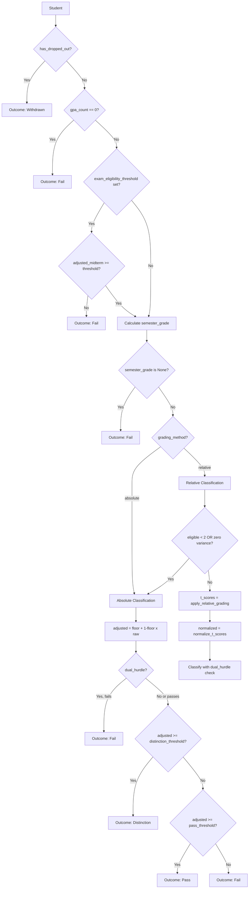

# Grading & GPA System

SynthEd uses a dual-track GPA system that is the most common source of confusion in the codebase.
This page explains the two tracks, the grading pipeline, and outcome classification.

> **Key insight**: A student with low raw quality still gets a non-zero transcript GPA (grade floor),
> but theory modules see the true low quality via `perceived_mastery`. These two numbers diverge
> and serve different purposes.

---

## Dual-Track GPA

Source: `synthed/simulation/engine.py` -- `SimulationState` dataclass and `_record_graded_item()` method

Every time a graded item (assignment or exam) is recorded, two parallel tracks are updated:

### Track 1: `cumulative_gpa` (Transcript GPA)

The grade the student sees on their transcript. A structural **grade floor** is applied before
scaling to 4.0.

**Formula** (in `_record_graded_item()`):

```
graded = grade_floor + (1 - grade_floor) * quality
gpa_points_sum += graded * _GPA_SCALE
gpa_count += 1
cumulative_gpa = gpa_points_sum / gpa_count
```

Where:
- `quality` is raw [0-1] score from the interaction
- `grade_floor` = 0.45 (default, from `GradingConfig.grade_floor`)
- `_GPA_SCALE` = 4.0 (from `EngineConfig._GPA_SCALE`)

**Example**: A student submits an assignment with raw quality = 0.30:
- `graded = 0.45 + (1 - 0.45) * 0.30 = 0.45 + 0.165 = 0.615`
- GPA contribution: `0.615 * 4.0 = 2.46`

Even a zero-quality submission gets `0.45 * 4.0 = 1.80` on the GPA scale.

### Track 2: `perceived_mastery` (Raw Quality)

What the student actually understands -- no floor, no inflation.

**Formula** (in `_record_graded_item()`):

```
perceived_mastery_sum += quality
perceived_mastery_count += 1
perceived_mastery = perceived_mastery_sum / perceived_mastery_count
```

Returns 0.5 when no items have been recorded (see the `@property` on `SimulationState`).

**Example** (same student): `perceived_mastery = 0.30` -- the raw truth.

### Why Two Tracks?

| Track | Used By | Purpose |
|-------|---------|---------|
| `cumulative_gpa` | Outcome classification, data export, assignment/exam quality formulas | Reflects institutional grading policy (floor, scale) |
| `perceived_mastery` | Baulke dropout (Phase 0->1, Phase 4->5), Kember cost-benefit, SDT competence | Theory modules need the unvarnished signal |

The separation prevents the grade floor from masking genuine academic struggle. A student with
`cumulative_gpa = 2.46` (looks OK) might have `perceived_mastery = 0.30` (actually struggling),
and theory modules correctly detect the struggle.

### Numeric Example: Divergence Over Time

| Week | Raw Quality | cumulative_gpa | perceived_mastery |
|------|------------|----------------|-------------------|
| 2 (assignment) | 0.30 | 2.46 | 0.30 |
| 4 (assignment) | 0.25 | 2.36 | 0.275 |
| 7 (midterm exam) | 0.20 | 2.25 | 0.25 |
| 10 (assignment) | 0.35 | 2.31 | 0.275 |

The GPA hovers around 2.3 (passing range) while mastery stays below 0.30 (non-fit territory
for Baulke's `_NONFIT_MASTERY_THRESHOLD` = 0.40).

---

## GradingConfig

Source: `synthed/simulation/grading.py` -- frozen dataclass

`GradingConfig` is a frozen dataclass that defines institution-level grading policy.
Override via `dataclasses.replace()`.

### Assessment Modes

| Mode | Behavior |
|------|----------|
| `"mixed"` (default) | Midterm components + final exam, weighted by `midterm_weight` / `final_weight` |
| `"exam_only"` | `semester_grade = final_score` only. Note: `cumulative_gpa` still includes all graded items |
| `"continuous"` | All weight on midterm components, no final needed |

### Key Fields

| Field | Default | Purpose |
|-------|---------|---------|
| `scale` | `GradingScale.SCALE_100` | Output scale (100-point or 4.0) |
| `assessment_mode` | `"mixed"` | See above |
| `midterm_weight` | 0.40 | Weight of midterm aggregate |
| `final_weight` | 0.60 | Weight of final exam |
| `midterm_components` | `{"exam": 0.50, "assignment": 0.30, "forum": 0.20}` | Component weights (must sum to 1.0) |
| `grading_method` | `"absolute"` | `"absolute"` or `"relative"` |
| `grade_floor` | 0.45 | Structural grade floor |
| `pass_threshold` | 0.64 | Minimum for Pass (on floor-adjusted scale) |
| `distinction_threshold` | 0.73 | Minimum for Distinction (on floor-adjusted scale) |
| `dual_hurdle` | `False` | Both midterm and final must independently pass |
| `component_pass_thresholds` | `{}` | Per-component thresholds for dual hurdle |
| `exam_eligibility_threshold` | `None` | Midterm score required to sit the final exam |
| `late_penalty` | 0.05 | Late submission penalty |
| `noise_std` | 0.05 | Measurement noise (not used by engine) |
| `missing_policy` | `"zero"` | `"zero"` or `"redistribute"` for missing components |
| `distribution` | `"beta"` | Grade distribution type (not used by engine) |
| `dist_alpha` / `dist_beta` | 5.0 / 3.0 | Distribution parameters (not used by engine) |

**Validation** (in `__post_init__`):
- `midterm_weight + final_weight` must sum to 1.0
- `midterm_components` values must sum to 1.0
- `distinction_threshold > pass_threshold`
- All numeric fields in valid ranges

---

## Semester Grade Calculation

Source: `synthed/simulation/grading.py` -- `calculate_semester_grade()`

Called at end-of-run by `_assign_outcomes()` via `_filter_eligible_states()`.

**For `"mixed"` mode:**

```
midterm_aggregate = sum(component_mean * component_weight for each component)
semester_grade = midterm_aggregate * midterm_weight + final_score * final_weight
```

Where `component_mean = sum(scores) / n_total` (uses correct denominator -- submitted 2/4 = sum/4).

**For `"exam_only"` mode:** `semester_grade = final_score`

**For `"continuous"` mode:** `semester_grade = midterm_aggregate * midterm_weight` (no final needed)

> **Important**: `semester_grade` on `SimulationState` is raw [0-1], NOT floor-adjusted.
> The floor is applied during outcome classification, not during grade calculation.

---

## Outcome Classification Flow

Source: `synthed/simulation/engine.py` -- `_assign_outcomes()` and related methods



### Step-by-Step

1. **Dropped out?** -> "Withdrawn"
2. **No graded items?** (`gpa_count == 0`) -> "Fail"
3. **Exam eligibility check** (optional): if `exam_eligibility_threshold` is set, the floor-adjusted
   midterm aggregate must meet it, otherwise -> "Fail"
4. **Calculate `semester_grade`**: raw [0-1] via `calculate_semester_grade()`
5. **Dispatch** to absolute or relative grading

### Absolute Grading

Source: `_assign_outcomes_absolute()` and `_classify_absolute_single()`

1. Floor-adjust the grade: `adjusted = floor + (1 - floor) * raw`
2. Check dual hurdle (if enabled): both midterm and final must independently pass
3. Classify: `adjusted >= distinction_threshold` -> Distinction, `>= pass_threshold` -> Pass, else Fail

**Example** (defaults: floor=0.45, pass=0.64, distinction=0.73):
- Raw quality = 0.50: `adjusted = 0.45 + 0.55 * 0.50 = 0.725` -> Pass (0.725 >= 0.64 but < 0.73)
- Raw quality = 0.55: `adjusted = 0.45 + 0.55 * 0.55 = 0.7525` -> Distinction (>= 0.73)
- Raw quality = 0.30: `adjusted = 0.45 + 0.55 * 0.30 = 0.615` -> Fail (< 0.64)

### Relative Grading

Source: `_assign_outcomes_relative()`

1. Collect raw `semester_grade` for all eligible (non-dropped, non-zero-grade) students
2. **Fallback check**: if fewer than 2 eligible students OR zero variance -> fall back to absolute
3. Apply t-score standardization: `T = 50 + 10 * (X - mean) / std`
   - Population std (ddof=0) -- the cohort IS the population
   - Warns if n < 30 (`_MIN_T_SCORE_N`)
4. Normalize t-scores to [0-1]: `normalized = t_score / 100`
5. Classify using the same thresholds + dual hurdle check

**Fallback conditions** (in `_assign_outcomes_relative()`):
- `len(eligible) < 2` -> absolute fallback with warning
- All t-scores equal 50.0 (zero variance) -> absolute fallback with warning

### Dual Hurdle

Source: `grading.py` -- `check_dual_hurdle_pass()`

When `GradingConfig.dual_hurdle = True`, both midterm and final must independently meet their
thresholds in `component_pass_thresholds`.

```python
# Example configuration
GradingConfig(
    dual_hurdle=True,
    component_pass_thresholds={"midterm": 0.40, "final": 0.40},
)
```

A student who aces the final but fails the midterm component will get "Fail" regardless of
their overall grade.

---

## Piecewise-Linear GPA Conversion

Source: `synthed/simulation/grading.py` -- `piecewise_gpa()` and `_GPA_BREAKPOINTS`

When `GradingScale.SCALE_4` is used, raw [0-1] quality is converted to 0-4.0 GPA
using piecewise-linear interpolation between these breakpoints:

| Quality (0-1) | GPA (0-4.0) |
|---------------|-------------|
| 0.00 | 0.0 |
| 0.40 | 1.0 |
| 0.55 | 2.0 |
| 0.70 | 3.0 |
| 0.85 | 3.7 |
| 1.00 | 4.0 |

These breakpoints are OULAD/WES-grounded. Between breakpoints, linear interpolation applies.

**Example**: quality = 0.62 falls between (0.55, 2.0) and (0.70, 3.0):
- `frac = (0.62 - 0.55) / (0.70 - 0.55) = 0.467`
- `GPA = 2.0 + 0.467 * 1.0 = 2.467`

---

## Functions Not Used by Engine

Two functions in `grading.py` exist but are NOT called by `SimulationEngine`:

| Function | Purpose | Why Not Used |
|----------|---------|--------------|
| `compute_grade()` | Apply floor + noise + scale conversion | Engine applies floor in `_record_graded_item` and `_assign_outcomes` separately |
| `sample_base_quality()` | Sample from grade distribution | Engine computes quality from persona traits directly |

These are available for external use, Sobol analysis, and future versions.

---

## How the Engine Records Grades

Source: `engine.py` -- `_record_graded_item()`, `_sim_assignment()`, `_sim_exam()`

The engine records grades in two places per graded interaction:

1. **`_record_graded_item(state, quality)`**: Updates both GPA tracks (cumulative_gpa and perceived_mastery)
2. **Score lists**: Appends to `state.assignment_scores`, `state.midterm_exam_scores`, or `state.final_score`

The score lists hold raw [0-1] quality values. The floor adjustment happens only at classification time.

**Assignment quality formula** (simplified):

```
quality = (gpa_weight * gpa_normalized
         + eng_weight * engagement
         + efficacy_weight * self_efficacy
         + reading_weight * reading_hours_normalized
         + noise_weight * noise)
```

Weights from `EngineConfig`: `_ASSIGN_GPA_WEIGHT` (0.25) + `_ASSIGN_ENG_WEIGHT` (0.25) +
`_ASSIGN_EFFICACY_WEIGHT` (0.20) + `_ASSIGN_READING_WEIGHT` (0.15) + `_ASSIGN_NOISE_WEIGHT` (0.15) = 1.0.

**Exam quality formula** uses similar structure with different weights (see `EngineConfig`).

---

## Gotchas

- **`semester_grade` is raw, NOT floor-adjusted**: The `semester_grade` field on `SimulationState`
  stores the raw [0-1] weighted average. The floor is applied only during outcome classification
  in `_classify_absolute_single()`. Do not compare `semester_grade` directly against
  `pass_threshold` -- the threshold is on the floor-adjusted scale.

- **`cumulative_gpa` includes ALL graded items in `exam_only` mode**: Even though `semester_grade`
  uses only `final_score`, the running `cumulative_gpa` accumulates midterm exam and assignment
  scores too. This affects assignment/exam quality formulas that use `cumulative_gpa` as input.

- **Thresholds are on the transcript scale**: `pass_threshold` (0.64) and `distinction_threshold`
  (0.73) are compared against `floor + (1-floor) * raw`, not against raw quality. With the default
  floor of 0.45, a raw quality of ~0.345 maps to 0.64 (pass) and ~0.509 maps to 0.73 (distinction).

- **Grade floor inflates ALL grades**: Even a zero-quality item gets `floor * GPA_SCALE = 1.80`
  on the 4.0 scale. This is intentional -- it models partial credit and baseline marks from
  assignment templates.

- **Relative grading falls back automatically**: If the cohort has fewer than 2 eligible students or
  zero variance in grades, relative grading automatically falls back to absolute with a log warning.
  This can happen in small simulations or when most students drop out.

- **`perceived_mastery` returns 0.5 with no items**: The `@property` returns 0.5 (neutral) when
  `perceived_mastery_count == 0`. This means theory modules see a neutral signal early in the
  semester, not zero. The `_NONFIT_GPA_MIN_ITEMS = 2` guard in Baulke prevents premature
  non-fit detection.

- **Component weight validation**: `midterm_components` must sum to 1.0 and only accept keys
  `{"exam", "assignment", "forum"}` (enforced in `GradingConfig.__post_init__`). The assignment
  and exam quality weight sums are also validated in `EngineConfig.__post_init__`.

- **`compute_grade()` and `sample_base_quality()` are NOT used by the engine**: These exist for
  external consumers. If you modify them, engine behavior is unaffected. If you need to change
  how the engine grades, modify `_record_graded_item()` and `_assign_outcomes()`.

---

*See also: [Pipeline Walkthrough](pipeline-walkthrough.md) for where grading fits in the pipeline, [Simulation Loop](simulation-loop.md) for the end-of-run outcome assignment, [Theory Module Reference](theory-modules.md) for which modules read perceived_mastery vs cumulative_gpa, [Dropout Mechanics](dropout-mechanics.md) for how mastery triggers dropout phases, [Engagement Formula](engagement-formula.md) for academic outcome bonuses/penalties, [Data Export](data-export.md) for how GPA and outcomes appear in CSV files.*
