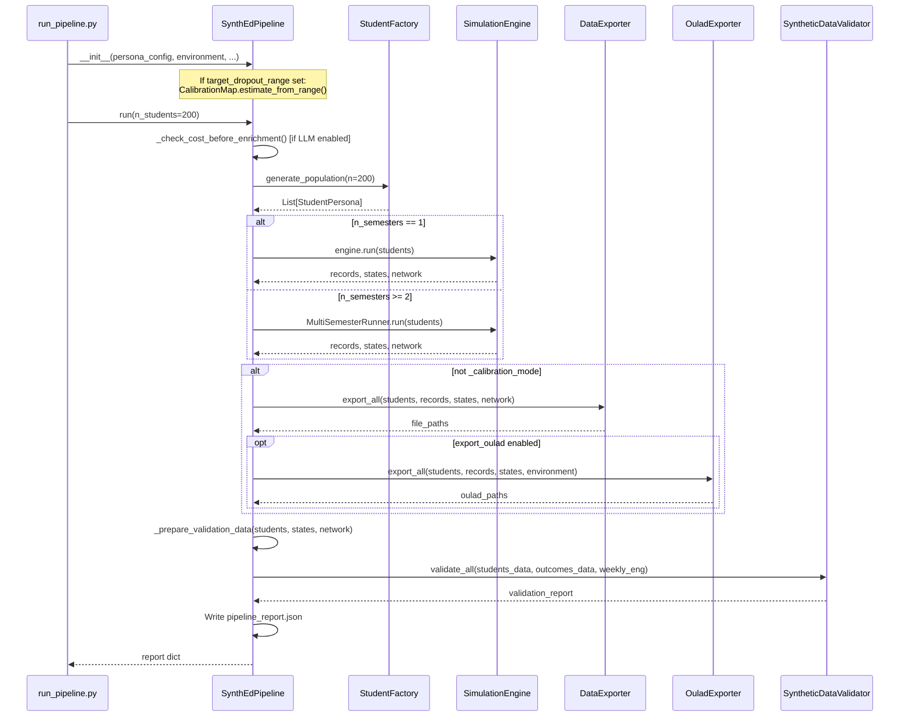
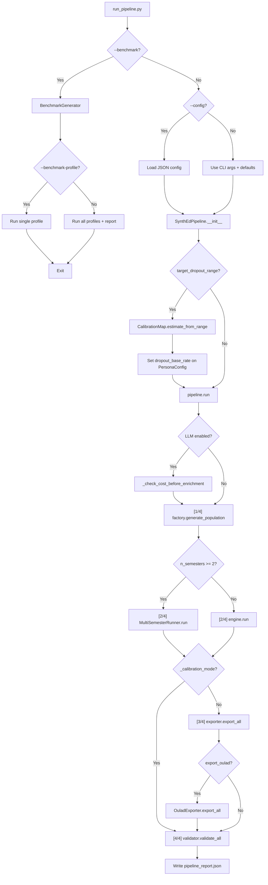

# Pipeline Walkthrough

This page traces the full execution path from `python run_pipeline.py` through every pipeline stage to the final report. For CLI flags and configuration options, see [GUIDE.md](../GUIDE.md).

---

## Entry Points

SynthEd has two entry points:

1. **CLI** — `run_pipeline.py` parses arguments, creates a `SynthEdPipeline`, and calls `pipeline.run()`
2. **Python API** — instantiate `SynthEdPipeline` directly and call `.run()`

```python
from synthed.pipeline import SynthEdPipeline
pipeline = SynthEdPipeline(output_dir="./output", seed=42)  # All parameters are optional
report = pipeline.run(n_students=200)
```

---

## Pipeline Sequence Diagram



---

## Pipeline Decision Flowchart



---

## `SynthEdPipeline.__init__()` — What Gets Created

When you instantiate the pipeline, these components are created:

| Component | Class | Purpose |
|-----------|-------|---------|
| `self.factory` | `StudentFactory` | Population generation from `PersonaConfig` distributions |
| `self.engine` | `SimulationEngine` | Week-by-week simulation with all theory modules |
| `self.exporter` | `DataExporter` | CSV export (4 standard tables) |
| `self.validator` | `SyntheticDataValidator` | Statistical validation against `ReferenceStatistics` |
| `self.llm` | `LLMClient` or `None` | Optional LLM for persona backstory enrichment |

If `target_dropout_range` is provided, `_apply_calibration()` runs immediately during `__init__()`:

1. `CalibrationMap().estimate_from_range(target_range, n_semesters)` computes an estimated `dropout_base_rate`
2. `PersonaConfig` is replaced (immutably) with the calibrated `dropout_base_rate`
3. `ReferenceStatistics` is updated with the target range midpoint for validation

---

## `pipeline.run()` — Stage by Stage

### Stage 1: Cost Check (conditional)

When LLM enrichment is enabled (`use_llm=True`), `_check_cost_before_enrichment(n_students)` runs first:

- Estimates cost via `LLMClient.estimate_cost(n_calls=n_students)`
- If cost exceeds `cost_threshold` (default `_DEFAULT_COST_THRESHOLD_USD` = 1.0 USD), prompts the user via `confirm_callback`
- In library mode (no callback), blocks by default to prevent surprise charges

### Stage 2: Population Generation

`factory.generate_population(n=n_students, enrich_with_llm=enrich)` creates the student population:

- Each student is a frozen `StudentPersona` dataclass
- Traits are sampled from distributions defined in `PersonaConfig`
- Optional LLM enrichment adds narrative backstories

### Stage 3: Simulation

The branching point: single vs. multi-semester.

**Single semester** (`n_semesters <= 1`, the default):
```python
records, states, network = self.engine.run(students)
```

**Multi-semester** (`n_semesters >= 2`):
```python
runner = MultiSemesterRunner(self.engine, self.n_semesters, ...)
result = runner.run(students)
records, states, network = result.all_records, result.final_states, result.final_network
```

`MultiSemesterRunner` loops through semesters sequentially:
1. Run `engine.run()` with current active students
2. Tag records with semester metadata, offset week numbers
3. Filter out permanently dropped students (Baulke phase >= 5 or unavoidable withdrawal)
4. Apply carry-over adjustments to surviving students (see [Simulation Loop](simulation-loop.md))
5. Feed adjusted state into next semester

### Stage 4: Export (skipped in calibration mode)

When `_calibration_mode=True` (used internally by NSGA-II), export is skipped entirely to save I/O.

**Standard export** — `DataExporter.export_all()` writes 4 CSV files. See [Data Export](data-export.md).

**OULAD export** (optional, `--oulad` flag) — `OuladExporter.export_all()` writes 7 additional CSV tables in OULAD-compatible format.

### Stage 5: Validation

`_prepare_validation_data()` computes derived fields needed by the validator:
- CoI composite: average of social, cognitive, and teaching presence
- Network degree from `SocialNetwork`
- Four factor clusters (student characteristics, skills, external factors, internal factors)

`validator.validate_all()` runs the statistical test suite and returns a structured report.

### Stage 6: Report

The full report is written to `pipeline_report.json` in the output directory. Includes timing breakdowns, population summary, simulation summary, validation results, and optional LLM costs.

---

## CalibrationMap: Target Dropout Mapping

`CalibrationMap` uses piecewise linear interpolation to convert a target dropout rate into a `dropout_base_rate` parameter.

**How it works:**

1. `CALIBRATION_DATA` in `synthed/calibration.py` contains empirically measured points (N=500, 5 seeds averaged per point)
2. Each point maps a `dropout_base_rate` to an `observed_dropout_rate` for a given `n_semesters`
3. `np.interp()` interpolates between these points
4. Result is clamped to [`_MIN_BASE_RATE` (0.10), `_MAX_BASE_RATE` (0.95)]

**Example:**

Target range `(0.40, 0.60)` with 1 semester:
1. Midpoint = 0.50, tolerance = 0.10
2. Looking up observed rates in `CALIBRATION_DATA` for 1 semester:
   - `dropout_base_rate=0.40` -> `observed=0.390`
   - `dropout_base_rate=0.50` -> `observed=0.442`
   - `dropout_base_rate=0.60` -> `observed=0.468`
   - `dropout_base_rate=0.70` -> `observed=0.512`
3. Interpolating for target 0.50: estimated `dropout_base_rate` falls between 0.60 and 0.70
4. Confidence: "high" (within interpolated range) or "low" (clamped/edge)

**Confidence levels:**
- `"high"` — target is within the calibrated range and data exists for the requested `n_semesters`
- `"low"` — target is outside the calibrated range, OR semester fallback was used (no data for requested `n_semesters`, fell back to 1-semester data)

---

## The `_calibration_mode` Flag

When `_calibration_mode=True`:
- Export is skipped (no CSV files written)
- `output_dir` can be `None`
- Report is not written to disk
- This is used by `_sim_runner.py` inside the NSGA-II calibrator to run fast simulation-only passes

---

## Gotchas

- **CalibrationMap is NOT a live optimizer** — it is a static lookup table measured at a specific point in time. If you change engine weights, theory modules, or RNG-consuming code paths (even non-dropout features), the calibration data becomes stale. Re-measure using `run_calibration.py`.
- **`_apply_calibration()` mutates `PersonaConfig` and `ReferenceStatistics`** — via `dataclasses.replace()` (immutable replacement), so the original objects are not affected, but the pipeline's internal references change.
- **Multi-semester `n_semesters=1`** — `MultiSemesterRunner` requires `n_semesters >= 2`. The pipeline routes `n_semesters <= 1` directly to `engine.run()`.
- **LLM cost check happens before generation** — if you set `use_llm=True` but enrichment is blocked by the cost check, students are still generated (without LLM backstories).
- **Validation always runs** — even in `_calibration_mode`, the validator is called. Only export is skipped.
- **`from_profile()` class method** — creates a pipeline from a named benchmark profile, using the profile's `expected_dropout_range` as the `target_dropout_range` for calibration.

---

*See also: [Simulation Loop](simulation-loop.md) for the weekly engine loop, [Engagement Formula](engagement-formula.md) for the multi-theory composer, [Theory Module Reference](theory-modules.md) for all 11 modules, [Dropout Mechanics](dropout-mechanics.md) for the Baulke phase model, [Grading & GPA](grading-and-gpa.md) for outcome classification, [Calibration & Analysis](calibration-and-analysis.md) for CalibrationMap internals, [Data Export](data-export.md) for CSV output formats.*
