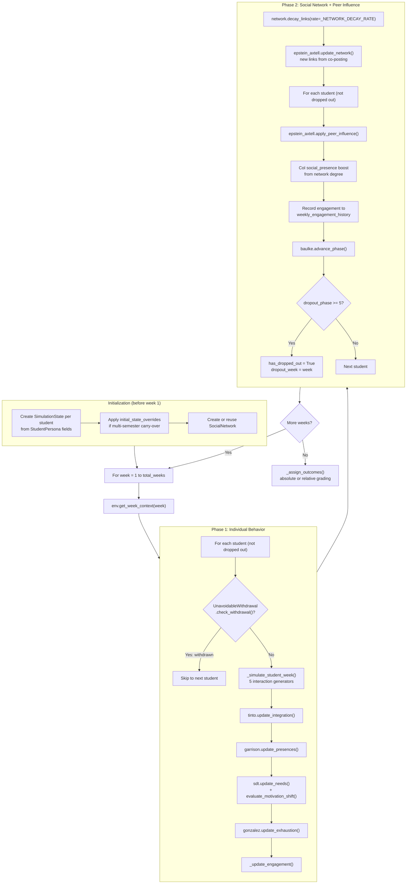
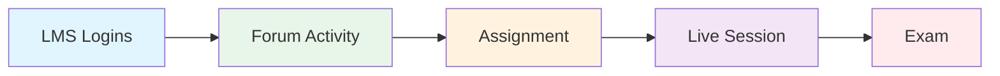

# The Weekly Simulation Loop

This page documents the two-phase weekly simulation loop at the core of SynthEd. For how individual theory modules work, see [Theory Module Reference](theory-modules.md). For the engagement update formula specifically, see [Engagement Formula](engagement-formula.md).

---

## Overview

`SimulationEngine.run()` in `synthed/simulation/engine.py` runs a two-phase weekly loop inspired by Epstein & Axtell (1996):

- **Phase 1 (Individual):** Each non-dropped student acts independently — interactions, theory updates, engagement update
- **Phase 2 (Social):** Network formation, peer influence, engagement recording, dropout phase advancement

This separation ensures that one student's interactions in a given week do not affect another student's interactions in that same week (Phase 1 isolation), while peer effects are applied uniformly after all individuals have acted (Phase 2).

---

## Weekly Loop Flowchart



---

## Initialization

Before the weekly loop begins, `engine.run()` initializes state for each student:

```
SimulationState(
    student_id           = student.id
    current_engagement   = student.base_engagement_probability
    academic_integration = student.academic_integration
    social_integration   = student.social_integration
    perceived_cost_benefit = student.perceived_cost_benefit
    courses_active       = first N courses (N = student.enrolled_courses)
    coi_state            = CommunityOfInquiryState(teaching_presence = inst.teaching_presence_baseline)
    sdt_needs            = SDTNeedSatisfaction(autonomy, competence, relatedness from persona)
    current_motivation_type = student.motivation_type
)
```

**State overrides** (multi-semester): When `initial_state_overrides` is provided (from `MultiSemesterRunner`), attributes are set via `setattr()` after default initialization. This carries forward evolved values like `dropout_phase`, `cumulative_gpa`, `exhaustion`, and `coi_state`.

---

## Phase 1: Individual Behavior

For each week, every non-dropped student goes through Phase 1 in order:

### Step 1: Unavoidable Withdrawal Check

`UnavoidableWithdrawal.check_withdrawal()` models stochastic life events (medical emergency, family crisis, etc.) that force withdrawal regardless of engagement or dropout phase. The per-week probability is spread from `per_semester_probability` / `total_weeks`.

If triggered, the student is immediately marked as dropped out with `withdrawal_reason` set — the Baulke phase model is bypassed entirely.

### Step 2: Interaction Generation

`_simulate_student_week()` generates 5 types of interactions, in this exact order per course:

```
1. _sim_lms_logins()    — Poisson-distributed login count
2. _sim_forum_activity() — forum reads + posts (if course.has_forum)
3. _sim_assignment()     — submit or miss (if week in course.assignment_weeks)
4. _sim_live_session()   — attend or skip (if course.has_live_sessions)
5. _sim_exam()           — take or skip (if week == midterm_week or final_week)
```

**Interaction generation order diagram:**



> **RNG determinism**: This order is critical. Each generator consumes random draws from `self.rng` (numpy) and `random` (stdlib). Changing the order — or adding a new generator between existing ones — shifts all subsequent random draws, changing the entire simulation trajectory.

### Step 3: Theory Updates

After interactions are generated, four theory modules update the student's state:

1. **`tinto.update_integration()`** — updates `academic_integration` and `social_integration` based on this week's interactions
2. **`garrison.update_presences()`** — updates CoI social, cognitive, and teaching presence based on interactions and active courses
3. **`sdt.update_needs()`** + **`sdt.evaluate_motivation_shift()`** — updates autonomy/competence/relatedness needs, may shift `current_motivation_type`
4. **`gonzalez.update_exhaustion()`** — updates `exhaustion.exhaustion_level` based on workload and interactions, modulated by `InstitutionalConfig`

### Step 4: Engagement Update

`_update_engagement()` is the multi-theory engagement composer. It reads state from all theory modules and computes a new `current_engagement` value. See [Engagement Formula](engagement-formula.md) for the full term-by-term breakdown.

---

## Phase 2: Social Network + Peer Influence

Phase 2 runs after ALL students have completed Phase 1 for the week.

### Step 1: Network Link Decay

`network.decay_links(decay_rate=_NETWORK_DECAY_RATE)` — existing link strengths decay by `_NETWORK_DECAY_RATE` (default 0.02) each week. Links that decay below a threshold are removed.

### Step 2: Network Update

`epstein_axtell.update_network()` — new links are formed between students who co-posted in forums during this week. This models the Epstein & Axtell social simulation principle: agents interact and form connections through shared activity.

### Step 3: Per-Student Peer Effects

For each non-dropped student:

1. **Peer influence**: `epstein_axtell.apply_peer_influence()` — a student's engagement is pulled toward the average engagement of their network neighbors
2. **CoI social_presence boost**: network degree increases `social_presence` by `min(degree * _COI_DEGREE_FACTOR, _COI_DEGREE_CAP)` where `_COI_DEGREE_FACTOR` = 0.005 and `_COI_DEGREE_CAP` = 0.03. Clipped to [`_ENGAGEMENT_CLIP_LO`, `_ENGAGEMENT_CLIP_HI`].
3. **Engagement recorded**: `state.weekly_engagement_history.append(state.current_engagement)` — this happens AFTER peer influence, ensuring the recorded value reflects the final engagement for the week
4. **Baulke phase advancement**: `baulke.advance_phase()` evaluates whether the student moves to the next dropout phase (or recovers). See [Dropout Mechanics](dropout-mechanics.md).
5. **Dropout check**: If `dropout_phase >= 5`, the student is marked as dropped out and `dropout_week` is set.

---

## End-of-Run: Outcome Assignment

After the final week, `_assign_outcomes()` assigns `semester_grade` and `outcome` to each student.

Dispatches based on `grading_config.grading_method`:
- **Absolute grading** — `_assign_outcomes_absolute()`: each student graded independently against fixed thresholds
- **Relative grading** — `_assign_outcomes_relative()`: t-score normalization across the cohort, with fallback to absolute if fewer than 2 eligible students or zero variance

See [Grading & GPA](grading-and-gpa.md) for the full classification flow.

---

## Environment & Course Structure

### `ODLEnvironment` Dataclass

The environment defines the semester structure:

| Field | Default | Role |
|-------|---------|------|
| `semester_name` | Auto-generated (e.g., "Spring 2026") | Label only |
| `total_weeks` | 14 | Duration of simulation |
| `courses` | 4 default courses | Course catalog |
| `scheduled_events` | Week-keyed events (semester_start, midterm, etc.) | Informational context |
| `positive_events` | Week-keyed positive events (orientation, financial aid, etc.) | Counter-pressure for engagement |

### `Course` Dataclass

Each course carries Moore transactional distance fields:

| Field | Default | Role |
|-------|---------|------|
| `structure_level` | 0.5 | Rigidity of pacing/requirements (Moore TD) |
| `dialogue_frequency` | 0.3 | Instructor-initiated communication rate (Moore TD) |
| `instructor_responsiveness` | 0.5 | Speed/quality of instructor replies (Moore TD) |
| `assignment_weeks` | `[3, 6, 10, 13]` | Weeks when assignments are due |
| `midterm_week` | 7 | Week of midterm exam |
| `final_week` | 14 | Week of final exam |
| `has_forum` | `True` | Whether forum activity is generated |
| `has_live_sessions` | `False` | Whether live sessions are available |

### `get_week_context()`

Each week, `env.get_week_context(week)` builds a context dict consumed by theory modules:

```python
{
    "week": week,
    "semester_progress": week / total_weeks,
    "event": scheduled_events.get(week, "regular_week"),
    "active_assignments": [course_ids with assignments due this week],
    "is_exam_week": True/False,
    "total_workload_hours": sum of all courses,
    "lms_available": True,
    "positive_event": positive_events.get(week),  # None if no event
}
```

### Week Gating

Not all interaction types fire every week:

| Interaction | When it fires |
|-------------|---------------|
| LMS logins | Every week |
| Forum reads/posts | Every week (if `course.has_forum`) |
| Assignment submission | Only on `course.assignment_weeks` |
| Live sessions | Every week (if `course.has_live_sessions`) |
| Exams | Only on `course.midterm_week` and `course.final_week` |

Default course configs create a varied schedule:
- **CS101**: assignments weeks [3, 6, 10, 13], midterm week 7, final week 14, has live sessions
- **MATH201**: assignments weeks [2, 5, 8, 11, 13], midterm week 7, final week 14, no live sessions
- **EDU301**: assignments weeks [4, 9, 13], midterm week 7, final week 14, has live sessions
- **PSY202**: assignments weeks [3, 6, 10, 13], midterm week 7, final week 14, no live sessions

---

## RNG Determinism

Two RNG sources are seeded in `SimulationEngine.__init__()`:

1. `self.rng = np.random.default_rng(seed)` — numpy Generator, used by most interaction generators
2. `random.seed(seed)` — Python stdlib, used by some theory modules

**Why both?** Historical — some theory modules use `random.random()` while the engine uses numpy. Both must be seeded for full reproducibility.

**Why order matters:** Within `_simulate_student_week()`, the 5 interaction generators fire sequentially, each consuming draws from `self.rng`. If you insert a new generator between (say) forum and assignment, it shifts all random draws from assignment onward, producing a different simulation even with the same seed.

**Multi-semester note:** `MultiSemesterRunner` reuses the same `SimulationEngine` instance across semesters, so the RNG state continues from where the previous semester left off. This is intentional — it ensures different semesters produce different behavior.

---

## Gotchas

- **Phase 1/Phase 2 boundary is strict** — engagement is updated in Phase 1, but recorded to history in Phase 2 (after peer influence). If you add logging in Phase 1, the engagement value you see is BEFORE peer influence.
- **Unavoidable withdrawal bypasses Baulke** — a student withdrawn in Phase 1 step 1 never enters `_simulate_student_week()` or `baulke.advance_phase()`. Their `dropout_phase` stays at whatever it was.
- **`courses_active` is set once** — at initialization, from `student.enrolled_courses`. Students do not drop individual courses during the semester.
- **State overrides use `setattr()`** — the multi-semester carry-over sets attributes directly on `SimulationState` (which is mutable). This is the one place where direct mutation is intentional.
- **`weekly_engagement_history` is per-semester** — in multi-semester mode, the carry-over resets this to `[]` for each new semester. The `MultiSemesterResult.all_records` aggregates across semesters.
- **Network is shared across all students** — `SocialNetwork` is a single object. In multi-semester mode, it carries over with heavier decay (`network_link_decay` = 0.30 default vs. weekly `_NETWORK_DECAY_RATE` = 0.02).

---

*See also: [Pipeline Walkthrough](pipeline-walkthrough.md) for the full execution path, [Engagement Formula](engagement-formula.md) for the multi-theory composer, [Theory Module Reference](theory-modules.md) for all 11 modules, [Dropout Mechanics](dropout-mechanics.md) for the Baulke phase model, [Grading & GPA](grading-and-gpa.md) for outcome classification, [Calibration & Analysis](calibration-and-analysis.md) for CalibrationMap and Sobol, [Data Export](data-export.md) for CSV output formats.*
