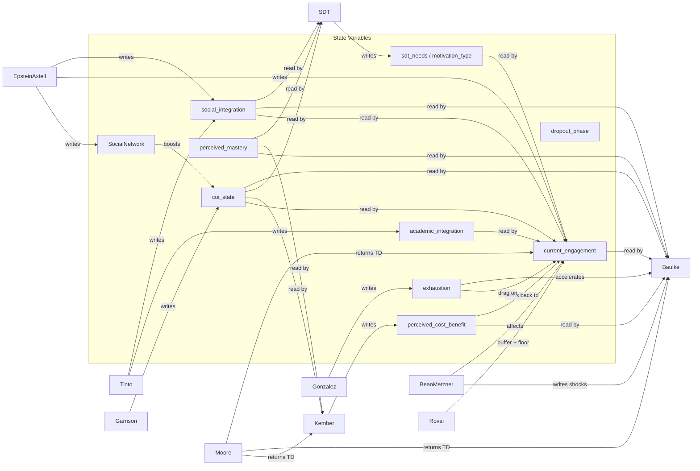

# Theory Module Reference

SynthEd integrates 11 theoretical frameworks as stateless Python classes plus one event handler.
Each module reads specific persona/state fields, writes to specific state fields, and fires at a
well-defined point in the weekly loop.

Since **v1.6.0**, theories that participate in the engagement composition step implement the
`contribute_engagement_delta()` protocol method. The engine's `_update_engagement()` dispatches to
all implementing modules in ascending `_ENGAGEMENT_ORDER`, replacing the previous ad-hoc call
sequence.

> **Convention**: Every module lives in `synthed/simulation/theories/` and exposes `_UPPERCASE`
> class-level constants. Override them via Sobol or NSGA-II prefix routing (see
> [calibration-and-analysis.md](calibration-and-analysis.md)).

---

## Module Summary Table

| # | Module | Class | File | Theory | `_PHASE_ORDER` | `_ENGAGEMENT_ORDER` | Called In |
|---|--------|-------|------|--------|:--------------:|:-------------------:|-----------|
| 1 | Tinto Integration | `TintoIntegration` | `theories/tinto.py` | Tinto (1975) | 10 | 100 | Phase 1 + Engagement |
| 2 | Bean & Metzner Pressure | `BeanMetznerPressure` | `theories/bean_metzner.py` | Bean & Metzner (1985) | — | 200 | Engagement |
| 3 | Kember Cost-Benefit | `KemberCostBenefit` | `theories/kember.py` | Kember (1989) | — | 900 | Engagement |
| 4 | Baulke Dropout Phase | `BaulkeDropoutPhase` | `theories/baulke.py` | Baeulke et al. (2022) | 50 | — | Phase 2 |
| 5 | Garrison CoI | `GarrisonCoI` | `theories/garrison_coi.py` | Garrison et al. (2000) | 20 | 700 | Phase 1 + Engagement |
| 6 | Moore Transactional Distance | `MooreTransactionalDistance` | `theories/moore_td.py` | Moore (1993) | — | 600 | Engagement |
| 7 | Epstein & Axtell Peer Influence | `EpsteinAxtellPeerInfluence` | `theories/epstein_axtell.py` | Epstein & Axtell (1996) | 40 | — | Phase 2 |
| 8 | Rovai Persistence | `RovaiPersistence` | `theories/rovai.py` | Rovai (2003) | — | 400 | Engagement |
| 9 | SDT Motivation Dynamics | `SDTMotivationDynamics` | `theories/sdt_motivation.py` | Deci & Ryan (1985) | 30 | 500 | Phase 1 + Engagement |
| 10 | Gonzalez Exhaustion | `GonzalezExhaustion` | `theories/academic_exhaustion.py` | Gonzalez et al. (2025) | — | 800 | Phase 1 + Engagement |
| 11 | Unavoidable Withdrawal | `UnavoidableWithdrawal` | `theories/unavoidable_withdrawal.py` | (life events) | — | — | Phase 1 (first check) |
| -- | Positive Event Handler | `PositiveEventHandler` | `theories/positive_events.py` | (counter-pressure) | — | 300 | Engagement |

> For academic citations and factor cluster tables, see `docs/THEORY.md`.

---

## Detailed Module Specifications

### 1. Tinto Integration

**Source**: `theories/tinto.py` -- Tinto (1975)

| | Fields |
|---|--------|
| **Reads** | `StudentPersona.personality.extraversion`, interaction records (`assignment_submit`, `exam`, `forum_post`, `forum_read`, `live_session`) |
| **Writes** | `SimulationState.academic_integration`, `SimulationState.social_integration` |
| **When** | Phase 1 -- after `_simulate_student_week()`, before engagement update |

**Key constants:**

| Constant | Default | Purpose |
|----------|---------|---------|
| `_ACADEMIC_QUALITY_FACTOR` | 0.05 | Academic integration boost per quality delta |
| `_ACADEMIC_EROSION` | 0.02 | Weekly erosion when no academic activity |
| `_FORUM_POST_BOOST` | 0.03 | Social integration boost per forum post |
| `_MAX_POST_CREDIT` | 3 | Max forum posts that count |
| `_LIVE_SESSION_BOOST` | 0.02 | Social integration boost for live attendance |
| `_LURK_BOOST` | 0.005 | Minimal boost for reading without posting |
| `_ISOLATION_EROSION` | 0.03 | Durkheim: erosion when fully isolated |
| `_ACADEMIC_CLIP_LO` / `_HI` | 0.01 / 0.95 | Academic integration bounds |
| `_SOCIAL_CLIP_LO` / `_HI` | 0.01 / 0.80 | Social integration bounds |

**InstitutionalConfig**: None.

---

### 2. Bean & Metzner Pressure

**Source**: `theories/bean_metzner.py` -- Bean & Metzner (1985)

| | Fields |
|---|--------|
| **Reads** | `StudentPersona.is_employed`, `.weekly_work_hours`, `.has_family_responsibilities`, `.financial_stress`, `.disability_severity`, `.self_regulation`, `.personality.conscientiousness` |
| **Writes** | `SimulationState.coping_factor`, `SimulationState.env_shock_remaining`, `.env_shock_magnitude` (shock state managed in `contribute_engagement_delta()`) |
| **When** | Engagement update -- `contribute_engagement_delta()` dispatched at `_ENGAGEMENT_ORDER = 200` |

**Key constants:**

| Constant | Default | Purpose |
|----------|---------|---------|
| `_OVERWORK_THRESHOLD_HOURS` | 30 | Weekly hours triggering overwork penalty |
| `_OVERWORK_PENALTY` | 0.025 | Engagement erosion from overwork |
| `_FAMILY_PENALTY` | 0.02 | Engagement erosion from family responsibilities |
| `_FINANCIAL_STRESS_THRESHOLD` | 0.5 | Stress level triggering financial penalty |
| `_FINANCIAL_PENALTY` | 0.015 | Engagement erosion from financial stress |
| `_DISABILITY_PENALTY` | 0.015 | Engagement erosion from disability challenges |
| `_COPING_MAX` | 0.50 | Maximum coping factor (50% pressure reduction) |
| `_COPING_GROWTH_RATE` | 0.03 | Weekly coping growth rate |
| `_COPING_REG_WEIGHT` | 0.60 | Self-regulation weight in coping aptitude |
| `_COPING_CONSC_WEIGHT` | 0.40 | Conscientiousness weight in coping aptitude |
| `_SHOCK_BASE_PROB` | 0.04 | Base probability of environmental shock |
| `_SHOCK_MIN_DURATION` / `_MAX` | 1 / 3 | Shock duration range (weeks) |
| `_SHOCK_MIN_MAGNITUDE` / `_MAX` | 0.3 / 1.0 | Shock magnitude range |

**InstitutionalConfig**: None directly (but shocks affect engagement which is modulated elsewhere).

---

### 3. Kember Cost-Benefit

**Source**: `theories/kember.py` -- Kember (1989)

| | Fields |
|---|--------|
| **Reads** | `SimulationState.perceived_mastery`, `.perceived_mastery_count`, `.missed_assignments_streak`, `.coi_state` (all 3 presences), `.social_integration`; `StudentPersona.is_employed`, `.financial_stress`, `.has_family_responsibilities`; Moore avg TD |
| **Writes** | `SimulationState.perceived_cost_benefit` |
| **When** | Engagement update -- `contribute_engagement_delta()` dispatched at `_ENGAGEMENT_ORDER = 900`; conditional gate fires only on graded-item weeks, exam weeks, or missed streak >= 2 |

**Key constants:**

| Constant | Default | Purpose |
|----------|---------|---------|
| `_QUALITY_FACTOR` | 0.04 | CB sensitivity to academic quality |
| `_MISSED_PENALTY` | 0.03 | Penalty per missed-assignment streak event |
| `_TD_PENALTY_FACTOR` | 0.02 | Moore TD influence on perceived value |
| `_TEACHING_PRESENCE_FACTOR` | 0.03 | Garrison teaching presence boost |
| `_COI_COMPOSITE_FACTOR` | 0.02 | CoI composite influence on value |
| `_GPA_CB_FACTOR` | 0.01 | CB sensitivity to perceived mastery |
| `_OC_FACTOR` | 0.015 | Opportunity cost pressure per week |
| `_OC_STRESS_THRESHOLD` | 0.5 | Financial stress above this triggers OC |
| `_TIME_DISCOUNT_FACTOR` | 0.008 | Time-based CB erosion per week |
| `_CLIP_LO` / `_HI` | 0.05 / 0.95 | Cost-benefit bounds |

**InstitutionalConfig**: `instructional_design_quality` scales `_QUALITY_FACTOR` via `scale_by()`.

---

### 4. Baulke Dropout Phase

**Source**: `theories/baulke.py` -- Baeulke et al. (2022)

| | Fields |
|---|--------|
| **Reads** | `SimulationState.current_engagement`, `.weekly_engagement_history`, `.coi_state.cognitive_presence`, `.missed_assignments_streak`, `.social_integration`, `.perceived_cost_benefit`, `.perceived_mastery`, `.perceived_mastery_count`, `.env_shock_remaining`, `.env_shock_magnitude`, `.exhaustion`; `StudentPersona.base_dropout_risk`, `.financial_stress`; Moore avg TD |
| **Writes** | `SimulationState.dropout_phase`, `.memory` |
| **When** | Phase 2 -- after peer influence, after engagement history recorded |

See [dropout-mechanics.md](dropout-mechanics.md) for the full 6-phase state machine.

**Key constants:** See [dropout-mechanics.md](dropout-mechanics.md) for the complete threshold table.

**InstitutionalConfig**: None directly (but modulates upstream signals like engagement and cost-benefit).

---

### 5. Garrison CoI

**Source**: `theories/garrison_coi.py` -- Garrison et al. (2000)

| | Fields |
|---|--------|
| **Reads** | `StudentPersona.personality.extraversion`, `.institutional_support_access`; `Course.dialogue_frequency`, `.instructor_responsiveness`; interaction records (`forum_post`, `live_session`, `assignment_submit`, `exam`) |
| **Writes** | `SimulationState.coi_state.social_presence`, `.cognitive_presence`, `.teaching_presence` |
| **When** | Phase 1 -- after Tinto, before SDT |

**Key constants:**

| Constant | Default | Purpose |
|----------|---------|---------|
| `_FORUM_POST_SOCIAL_BOOST` | 0.03 | Social presence boost per forum post |
| `_LIVE_SESSION_SOCIAL_BOOST` | 0.02 | Social presence boost per live session |
| `_EXTRAVERSION_FACTOR` | 0.01 | Extraversion influence on social presence |
| `_SOCIAL_DECAY` | 0.02 | Weekly social presence decay |
| `_COGNITIVE_QUALITY_FACTOR` | 0.04 | Cognitive presence boost per quality delta |
| `_DEEP_POST_BOOST` | 0.02 | Boost for substantive forum posts |
| `_DEEP_POST_MIN_LENGTH` | 100 | Min post length for deep post credit |
| `_COGNITIVE_DECAY` | 0.01 | Weekly cognitive presence decay |
| `_DIALOGUE_FACTOR` | 0.02 | Teaching presence boost per dialogue delta |
| `_RESPONSIVENESS_FACTOR` | 0.01 | Teaching presence boost per responsiveness delta |
| `_SUPPORT_ACCESS_FACTOR` | 0.01 | Institutional support influence |
| `_PRESENCE_CLIP_LO` / `_HI` | 0.01 / 0.95 | Bounds for all three presences |

**InstitutionalConfig**: `teaching_presence_baseline` sets the initial `teaching_presence` value in `CommunityOfInquiryState` (direct init, not via `scale_by()`).

---

### 6. Moore Transactional Distance

**Source**: `theories/moore_td.py` -- Moore (1993)

| | Fields |
|---|--------|
| **Reads** | `Course.structure_level`, `.dialogue_frequency`, `.instructor_responsiveness`; `StudentPersona.learner_autonomy`; `SimulationState.courses_active` |
| **Writes** | None (returns a float consumed by engagement update and Kember) |
| **When** | Engagement update -- `contribute_engagement_delta()` dispatched at `_ENGAGEMENT_ORDER = 600` using pre-computed `ctx.avg_td`; result also passed to Kember |

**Key constants:**

| Constant | Default | Purpose |
|----------|---------|---------|
| `_STRUCTURE_WEIGHT` | 0.35 | Weight of course structure (raises TD) |
| `_DIALOGUE_WEIGHT` | 0.30 | Weight of dialogue frequency (lowers TD) |
| `_AUTONOMY_WEIGHT` | 0.25 | Weight of learner autonomy (lowers TD) |
| `_RESPONSIVENESS_WEIGHT` | 0.10 | Weight of instructor responsiveness (lowers TD) |
| `_OFFSET` | 0.30 | Baseline offset to centre TD distribution |
| `_DEFAULT_TD` | 0.5 | Fallback when no active courses |

**Formula**: `TD = structure * 0.35 - dialogue * 0.30 - autonomy * 0.25 - responsiveness * 0.10 + 0.30`, clipped to [0, 1].

**InstitutionalConfig**: None.

---

### 7. Epstein & Axtell Peer Influence

**Source**: `theories/epstein_axtell.py` -- Epstein & Axtell (1996)

| | Fields |
|---|--------|
| **Reads** | Interaction records (`forum_post`, `live_session`); `SocialNetwork` (peer states); `SimulationState.current_engagement`, `.social_integration` of all peers |
| **Writes** | `SocialNetwork` (link formation); `SimulationState.current_engagement`, `.social_integration` |
| **When** | Phase 2 -- `update_network()` then `apply_peer_influence()` per student |

**Key constants:**

| Constant | Default | Purpose |
|----------|---------|---------|
| `_FORUM_LINK_WEIGHT` | 0.05 | Tie strength from co-posting |
| `_LIVE_LINK_WEIGHT` | 0.03 | Tie strength from co-attending live session |
| `_SOCIAL_DEGREE_FACTOR` | 0.003 | Social integration boost per network degree |
| `_SOCIAL_DEGREE_CAP` | 0.02 | Max social integration boost from peers |
| `_SAMPLING_THRESHOLD` | 40 | Group size above which peers are sampled |
| `_DEGREE_CAP_PER_ACTIVITY` | 20 | Max peers sampled per activity type |
| `_ENGAGEMENT_CLIP_LO` / `_HI` | 0.01 / 0.99 | Engagement bounds |
| `_SOCIAL_CLIP_HI` | 0.80 | Social integration upper bound |

**Three influence channels:**
1. **Engagement contagion** -- peers pull engagement toward local mean
2. **Dropout contagion** -- peers in dropout phases penalize engagement
3. **Social integration reinforcement** -- degree boosts social integration (Tinto via ABSS)

**InstitutionalConfig**: None.

---

### 8. Rovai Persistence

**Source**: `theories/rovai.py` -- Rovai (2003)

| | Fields |
|---|--------|
| **Reads** | `StudentPersona.self_regulation`, `.goal_commitment`, `.self_efficacy`, `.learner_autonomy`, `.disability_severity`, `.institutional_support_access` |
| **Writes** | None (returns floats consumed by engagement update) |
| **When** | Engagement update -- `contribute_engagement_delta()` dispatched at `_ENGAGEMENT_ORDER = 400` (regulation buffer); `engagement_floor()` remains an explicit engine call after the dispatch loop |

**Key constants:**

| Constant | Default | Purpose |
|----------|---------|---------|
| `_REGULATION_FACTOR` | 0.03 | Self-regulation sensitivity for buffer |
| `_FLOOR_REGULATION_WEIGHT` | 0.15 | Self-regulation weight in floor |
| `_FLOOR_GOAL_WEIGHT` | 0.12 | Goal commitment weight in floor |
| `_FLOOR_EFFICACY_WEIGHT` | 0.10 | Self-efficacy weight in floor |
| `_FLOOR_AUTONOMY_WEIGHT` | 0.08 | Learner autonomy weight in floor |
| `_FLOOR_SCALE` | 0.50 | Scale factor; max floor ~0.22 |
| `_DISABILITY_SUPPORT_THRESHOLD` | 0.50 | Support level above which disability penalty vanishes |
| `_DISABILITY_FLOOR_PENALTY` | 0.40 | Max floor reduction factor at zero support |

**Formulas:**
- Buffer: `(self_regulation - 0.5) * 0.03`
- Floor: `(reg * 0.15 + goal * 0.12 + efficacy * 0.10 + autonomy * 0.08) * 0.50`, reduced by disability/accessibility gap

**InstitutionalConfig**: None directly, but `institutional_support_access` from persona interacts with disability penalty.

---

### 9. SDT Motivation Dynamics

**Source**: `theories/sdt_motivation.py` -- Deci & Ryan (1985)

| | Fields |
|---|--------|
| **Reads** | `StudentPersona.learner_autonomy`, `.self_regulation`, `.self_efficacy`; `SimulationState.social_integration`, `.coi_state.social_presence`, `.perceived_mastery`, `.perceived_mastery_count`, `.missed_assignments_streak`; interaction records |
| **Writes** | `SimulationState.sdt_needs` (autonomy, competence, relatedness), `.current_motivation_type` |
| **When** | Phase 1 -- after Garrison CoI, before engagement update |

**Key constants:**

| Constant | Default | Purpose |
|----------|---------|---------|
| `_AUTONOMY_FACTOR` | 0.03 | Autonomy need sensitivity |
| `_AUTONOMY_REGULATION_FACTOR` | 0.01 | Self-regulation contribution |
| `_AUTONOMY_DECAY` | 0.005 | Weekly autonomy decay |
| `_COMPETENCE_QUALITY_FACTOR` | 0.06 | Competence sensitivity to quality |
| `_COMPETENCE_EROSION` | 0.02 | Erosion when no academic activity |
| `_COMPETENCE_STREAK_PENALTY` | 0.02 | Per-streak competence erosion |
| `_COMPETENCE_STREAK_CAP` | 3 | Max streak multiplier |
| `_COMPETENCE_GPA_FACTOR` | 0.008 | Competence sensitivity to mastery |
| `_RELATEDNESS_SOCIAL_FACTOR` | 0.02 | Social integration influence |
| `_RELATEDNESS_COI_FACTOR` | 0.02 | CoI social presence influence |
| `_RELATEDNESS_FORUM_BOOST` | 0.015 | Boost per forum post |
| `_RELATEDNESS_LIVE_BOOST` | 0.01 | Boost per live session |
| `_RELATEDNESS_DECAY` | 0.01 | Weekly relatedness decay |
| `_NEED_CLIP_LO` / `_HI` | 0.01 / 0.99 | Bounds for all needs |
| `_INTRINSIC_THRESHOLD` | 0.60 | Composite above this = intrinsic |
| `_EXTRINSIC_THRESHOLD` | 0.35 | Composite above this = extrinsic |

**Composite weights** (in `SDTNeedSatisfaction`):
- `_AUTONOMY_COMPOSITE_WEIGHT` = 0.35
- `_COMPETENCE_COMPOSITE_WEIGHT` = 0.40
- `_RELATEDNESS_COMPOSITE_WEIGHT` = 0.25

**Motivation type thresholds**: composite >= 0.60 = intrinsic, >= 0.35 = extrinsic, below = amotivation.

**InstitutionalConfig**: None.

---

### 10. Gonzalez Exhaustion

**Source**: `theories/academic_exhaustion.py` -- Gonzalez et al. (2025)

| | Fields |
|---|--------|
| **Reads** | `StudentPersona.is_employed`, `.weekly_work_hours`, `.has_family_responsibilities`, `.financial_stress`, `.self_regulation`, `.personality.conscientiousness`; week context (`active_assignments`, `positive_event`) |
| **Writes** | `SimulationState.exhaustion` (`.exhaustion_level`, `.recovery_capacity`) |
| **When** | Phase 1 -- after SDT, before engagement update. Also `exhaustion_engagement_effect()` called inside `_update_engagement()` |

**Key constants:**

| Constant | Default | Purpose |
|----------|---------|---------|
| `_ASSIGNMENT_LOAD_WEIGHT` | 0.025 | Exhaustion from assignment load |
| `_STRESSOR_WEIGHT` | 0.020 | Exhaustion from environmental stressors |
| `_LOW_REGULATION_WEIGHT` | 0.015 | Amplification from low self-regulation |
| `_RECOVERY_BASE` | 0.035 | Base recovery rate |
| `_RECOVERY_CAP_DECAY` | 0.02 | Recovery capacity degradation rate |
| `_RECOVERY_CAP_REGEN` | 0.01 | Recovery capacity regeneration rate |
| `_ENGAGEMENT_IMPACT` | 0.04 | Engagement drag per unit of exhaustion |
| `_DROPOUT_THRESHOLD` | 0.70 | Exhaustion level that accelerates Baulke |

**Recovery capacity**: degrades when `exhaustion_level > 0.60`, regenerates when `< 0.30`. Range [0.1, 1.0].

**InstitutionalConfig**:
- `curriculum_flexibility` scales `_ASSIGNMENT_LOAD_WEIGHT` via `scale_by()` (inverted: high flexibility = less load)
- `support_services_quality` scales `_RECOVERY_BASE` via `scale_by()`

---

### 11. Unavoidable Withdrawal

**Source**: `theories/unavoidable_withdrawal.py`

| | Fields |
|---|--------|
| **Reads** | `SimulationState.has_dropped_out` |
| **Writes** | `SimulationState.has_dropped_out`, `.dropout_week`, `.withdrawal_reason`, `.memory` |
| **When** | Phase 1 -- first check before `_simulate_student_week()` |

**Not a phase-model module.** This models catastrophic life events that force immediate withdrawal
regardless of engagement or motivation. It bypasses the Baulke dropout-phase process entirely.

**Initialization**: takes `per_semester_probability` and `total_weeks`. Converts to weekly probability
via: `p_week = 1 - (1 - p_semester)^(1/N)`.

**Event types** (weighted):

| Event | Weight |
|-------|--------|
| `serious_illness` | 0.30 |
| `family_emergency` | 0.20 |
| `forced_relocation` | 0.15 |
| `career_change` | 0.15 |
| `military_deployment` | 0.10 |
| `death` | 0.05 |
| `legal_issues` | 0.05 |

**InstitutionalConfig**: None.

---

### Positive Event Handler (not a theory module)

**Source**: `theories/positive_events.py`

`_ENGAGEMENT_ORDER = 300`. Implements `contribute_engagement_delta()` as of v1.6.0.

| | Fields |
|---|--------|
| **Reads** | Week context (`positive_event` key) |
| **Writes** | `SimulationState.social_integration`, `.perceived_cost_benefit`, `.coi_state.teaching_presence` |
| **When** | Engagement update -- `contribute_engagement_delta()` dispatched at `_ENGAGEMENT_ORDER = 300`; side effects applied inside that method |

**Defined events:**

| Event | Engagement Boost | Side Effects |
|-------|-----------------|--------------|
| `orientation_welcome` | +0.03 | social_integration +0.02, teaching_presence +0.03 |
| `financial_aid_disbursement` | +0.02 | cost_benefit +0.03 |
| `semester_break` | +0.01 | (exhaustion recovery via context) |
| `holiday_boost` | +0.015 | -- |
| `peer_study_group` | +0.02 | social_integration +0.015 |

---

## Theory Interaction Graph

Modules do not call each other directly. They interact through shared state variables.
When Module A writes to a state field that Module B reads, a dependency exists.

**Key cross-module dependencies:**

1. **Tinto -> Engagement -> Baulke**: Academic/social integration feed engagement, which is the primary Baulke phase trigger
2. **Garrison CoI -> Kember -> Baulke**: CoI presences modulate cost-benefit, which gates Phase 3->4
3. **Gonzalez -> Baulke**: Exhaustion above `_DROPOUT_THRESHOLD` (0.70) accelerates phase transitions
4. **Moore -> Kember + Engagement**: Transactional distance penalizes both cost-benefit and engagement
5. **Epstein & Axtell -> Tinto + Engagement**: Peer influence modifies social integration and engagement after individual phase
6. **SDT -> Engagement**: Motivation type (intrinsic/extrinsic/amotivation) adds or subtracts from engagement
7. **Bean & Metzner shocks -> Baulke**: Severe shocks (`magnitude > 0.7`) can trigger Phase 2->3 directly

---

## Gotchas

- **Stateless classes, stateful constants**: Theory modules are stateless (no `self.xxx` state between calls), but their class-level `_UPPERCASE` constants are the tuning surface for Sobol/NSGA-II. Do not confuse the two.

- **Call order matters for RNG**: Within Phase 1, the order is Tinto -> Garrison -> SDT -> Gonzalez -> Engagement update. Changing this order changes RNG consumption and breaks determinism. Within the engagement composition step, call order is controlled by `_ENGAGEMENT_ORDER` (100–900); altering those values changes RNG consumption in the same way.

- **Moore returns, never writes**: `MooreTransactionalDistance` is the only module that never writes to `SimulationState`. It returns a float consumed by `_update_engagement()` and `kember.recalculate()`. This means its effect is always mediated.

- **Epstein & Axtell fires in Phase 2**: Unlike all other modules, peer influence runs after all individual students have been processed. This is the Epstein & Axtell (1996) two-phase design -- individuals first, then social effects.

- **Engagement update is now protocol-dispatched**: Since v1.6.0, `_update_engagement()` in `engine.py` is a 27-line dispatch loop that calls `contribute_engagement_delta()` on each theory module in `_ENGAGEMENT_ORDER` sequence. Theory-specific delta logic lives in the theory modules themselves, not in the engine. `engagement_floor()` (Rovai) remains an explicit post-loop engine call.

- **`perceived_mastery` vs `cumulative_gpa`**: Theory modules that need academic performance (Kember, SDT, Baulke) read `perceived_mastery` (raw quality, no floor), NOT `cumulative_gpa` (transcript GPA with floor). See [grading-and-gpa.md](grading-and-gpa.md).

- **Unavoidable withdrawal is checked first**: Before any interactions are generated for a student in a week, the unavoidable withdrawal check runs. If triggered, all subsequent processing (interactions, theory updates, engagement) is skipped via `continue`.

- **`scale_by()` neutrality**: When `InstitutionalConfig` param = 0.5, `scale_by()` returns the constant unchanged (`0.7 + 0.6 * 0.5 = 1.0`). Only Kember (`instructional_design_quality`) and Gonzalez (`curriculum_flexibility`, `support_services_quality`) use it.

---

*See also: [simulation-loop.md](simulation-loop.md) for the weekly execution order, [engagement-formula.md](engagement-formula.md) for the full engagement update decomposition, [dropout-mechanics.md](dropout-mechanics.md) for the Baulke phase model.*
